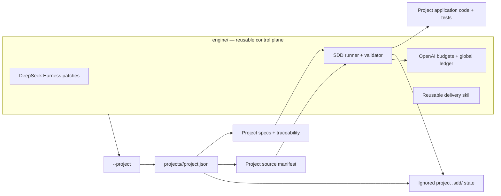
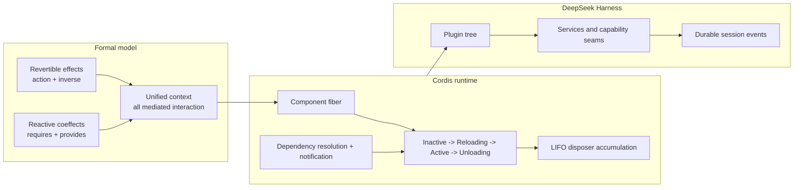
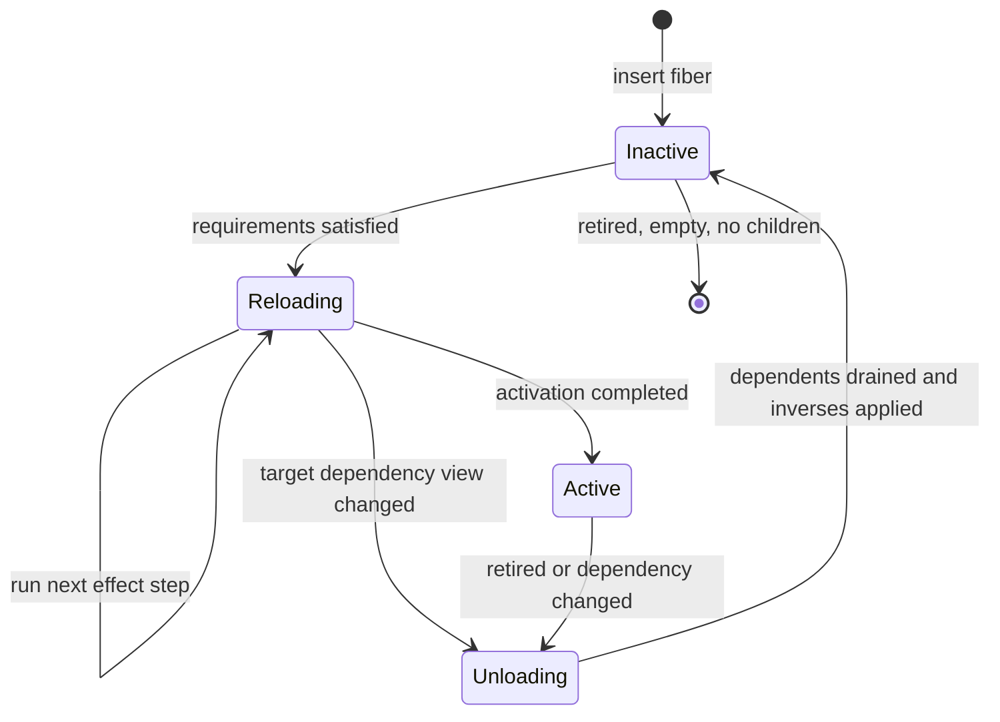
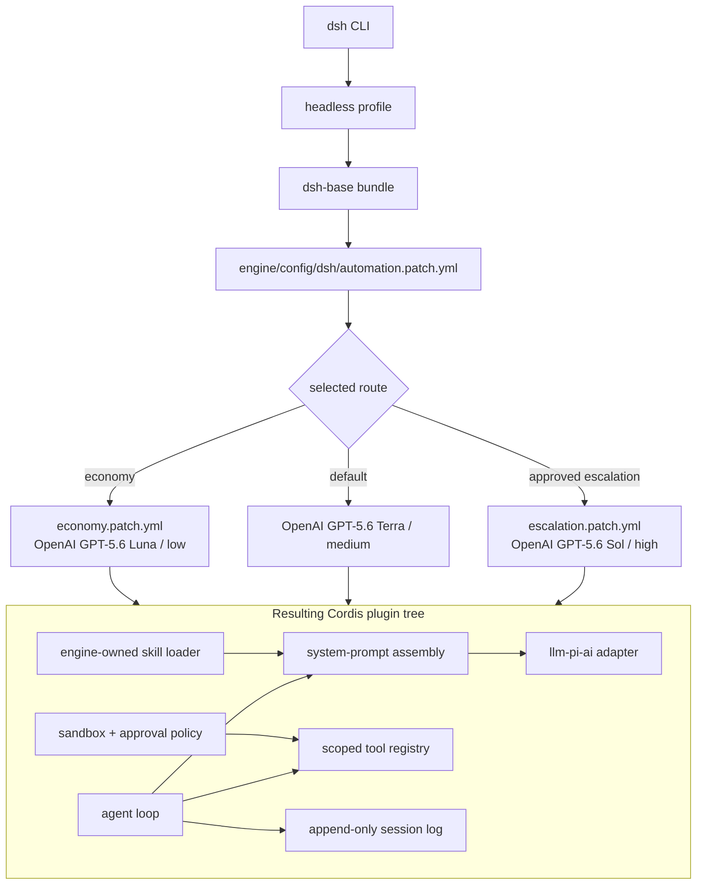
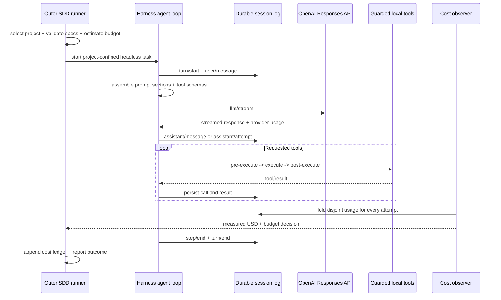
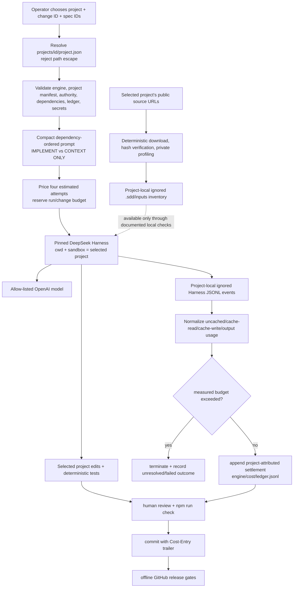

# Reusable SDD Delivery Engine

This repository now separates a reusable software-delivery engine from the projects it develops. The complete DeepSeek Harness/OpenAI control plane lives in [`engine/`](engine/); the VTEX exercise is the first independently specified project under [`projects/catalog-consolidation/`](projects/catalog-consolidation/). The catalog application itself is intentionally not implemented yet.

DeepSeek Harness orchestrates the engineering agent; OpenAI supplies every model call. The engine selects one project, turns a dependency-ordered subset of that project's specs into a bounded headless implementation run, verifies the result, and maps provider cost back to the project and change.

## What is ready

- A standalone `engine/` package with four verified infrastructure specs (`SDD-090`–`SDD-093`), pinned Harness, OpenAI cost control, multi-project selection, traceability, and release gates.
- A `projects/<project-id>/project.json` contract plus a model-free project scaffolder for adding new deliverables without copying engine code.
- Nine catalog product specs (`SDD-000`–`SDD-008`) covering the boundary, input, SQLite migration, deterministic identity, consolidation, security, tests, and delivery.
- Pinned catalog fixture URLs, byte sizes, and SHA-256 hashes; downloads stay private under the selected project's `.sdd/`.
- DeepSeek Harness `0.1.2-rc.1`, a project-confined headless runner, an engine-owned SDD skill, and an offline configuration smoke test.
- OpenAI-only routing: Terra is the default, Luna is the economy model, and Sol is escalation-only.
- Pre-call and live budget gates, provider-usage extraction, integer price arithmetic, and an append-only hash-chained project/change ledger.

## Workspace boundary



The separation is enforced at runtime, not merely documented:

- Project-scoped commands require a validated lower-kebab-case project ID.
- Descriptor paths must be relative and contained inside the selected project; real-path checks reject symlink escapes.
- Harness starts with the selected project as its working directory and filesystem-sandbox root.
- Prompts, downloaded inputs, session events, locks, and results stay in that project's ignored `.sdd/` directory.
- The engine configuration, reusable skill, price books, tests, and tamper-evident cost ledger stay under `engine/`.
- New projects reference the engine; they do not receive private copies of its runner or configuration.

## Why DeepSeek Harness

[DeepSeek Harness](https://github.com/deepseek-ai/deepseek-harness) is useful here because it is not a monolithic coding agent tied to one model vendor. It is an agent runtime built as a tree of replaceable plugins on [Cordis](https://github.com/cordiverse/cordis). The architectural foundation is described in the DeepSeek/Peking University paper [*A Programming Paradigm for Spatiotemporal Composability*](https://arxiv.org/abs/2608.25512); the concrete Harness wiring is documented in the upstream [architecture guide](https://github.com/deepseek-ai/deepseek-harness/blob/main/docs/architecture.md).

That combination provides several practical advantages for this project:

- **OpenAI without a Harness fork.** The model adapter and default-model selector are ordinary plugins. This repository replaces their configuration with the `openai` Responses route while retaining the Harness agent loop, tools, persistence, policy, and session machinery.
- **Small, reviewable composition.** Profiles assemble bundles and ordered patch layers. The checked-in base patch defines the common OpenAI catalog and safety limits; the economy and escalation overlays change only the intended route policy.
- **Lifecycle-safe extensibility.** Cordis tracks context-mediated effects together with their cleanup operations. Removing a component can unwind registrations and resources in last-in-first-out order instead of relying on a distant, easy-to-forget global teardown path.
- **Reactive dependencies.** Components declare what they require and provide. A dependent activates only when its requirements resolve, deactivates before a provider is withdrawn, and can reactivate when a compatible provider returns.
- **Durable auditability.** Model inputs, messages, attempts, tool calls, and results become session events. Successful, failed, cancelled, and retried attempts can therefore be audited and included in cost rather than only the final answer surviving.
- **Capability seams.** Models, tools, filesystem access, subprocesses, sandboxes, approvals, persistence, skills, and interfaces are swappable service-provider seams. Policy can intercept those seams without rewriting the agent loop.
- **Cost containment.** A small spec-scoped prompt, restricted tools, no hidden subagent fan-out, exact model routes, durable usage events, and an outer budget supervisor make the cost of a change observable and subject to conservative reservations and stop thresholds.

The engine still pins Harness because upstream labels it a developer preview and warns that compatibility-breaking changes should be expected.

## Architectural foundation: spatiotemporal composability

The paper starts from two independent problems in dynamically changing systems:

| Dimension | Question | Cordis mechanism | Practical result |
|---|---|---|---|
| Temporal composability | What must be undone when a component leaves? | **Revertible effects:** a context transformation returns an inverse, accumulated by the runtime | Component-local teardown can restore context-mediated state without restarting the process |
| Spatial composability | What happens when a dependency appears, disappears, or changes provider? | **Reactive coeffects:** required and provided keys are resolved against a changing context | Dependents activate, deactivate, or reload as their declared dependency view changes |

Cordis unifies both mechanisms in one first-class context. A component is conceptually a triple:

1. the coeffects it **requires** from its environment;
2. the keys/services it **provides** to the environment;
3. the effect function it runs, whose context-mediated changes yield inverse operations.

Each component instance is a **fiber** with its own context, parent, dependency view, accumulated disposer, and lifecycle state. The paper's runtime correspondence is approximately `ctx.effect` for reversible effects, `ctx.get`/`ctx.set` for coeffects, `ctx.use` for component instantiation, and `fiber.dispose` for the accumulated inverse.



The lifecycle is reactive rather than directly controlled by a plugin. The orchestrator requests insertion or retirement; the runtime decides when activation and deactivation are safe:



During activation, inverses are accumulated in last-in-first-out order. During withdrawal, a provider first stops advertising availability, its dependents are allowed to finish asynchronous teardown, and only then are the provider's own inverses applied. This ordering is the key connection between temporal cleanup and spatial dependency safety. Declarative configuration sits above the fibers: stable entry IDs, module URLs, configuration, isolation, interception, and enabled state are reconciled into the least disruptive fiber operations. Hot module replacement uses the same disposal/recreation machinery and rolls back to cached modules if a reload fails.

## DeepSeek Harness runtime architecture

A running `dsh` process is assembled from configuration rather than a privileged hard-coded core:



The selected profile contributes an ordered plugin tree. `dsh-base` supplies model adapters, the agent loop, session persistence, tools, credentials, sandboxing, approvals, and other services. `dsh-headless` adds the one-shot runner. Engine `--patch` files target plugin rows by ID and replace their configuration; `npm run dsh:config` resolves and verifies every route without making a model call.

One agent **turn** contains zero or more **steps**. Each step is one model request followed by the tool calls it requests:



Session events are the durable source of model history: resume, fork, replay, transcript projection, and this repository's cost observer derive from the log. Live `agent/*`, `llm/stream`, and `tools/*` events are interception points for in-flight behavior. Capability seams separate a service definition, a provider, and consumers, which is why swapping the LLM adapter does not require parallel versions of the loop or tools.

## How this repository applies the architecture

The engine scripts are intentionally outside the model-controlled runtime and form a delivery control plane around the selected project:



The deterministic boundary is deliberate. Project creation and selection, source downloading, hashing, schema profiling, dependency ordering, validation, pricing arithmetic, tests, and CI use no model. Harness and OpenAI are introduced only for bounded engineering work. A project's runtime remains model-free unless that project's own specifications explicitly require otherwise; the catalog application does not.

### Boundaries and non-guarantees

The paper's guarantees are conditional, not magic cleanup:

- Only operations mediated through the context and supplied with correct inverses are automatically reverted. External emissions such as sent network data cannot generally be undone; they require withholding/commit protocols or application-level compensation.
- Declared dependency access resembles capability control, but untrusted code can bypass language-level objects. A real hostile-code boundary still needs a process, WebAssembly, container, or comparable external sandbox. This project uses Harness workspace confinement for a trusted coding agent; it does not claim arbitrary-code isolation.
- Dependency cycles do not resolve automatically; mutually dependent components remain inactive unless the design is decomposed or the cycle is rejected.
- Key identity alone does not solve independently versioned interface compatibility. Package/version discipline and compatibility tests remain necessary.
- The paper's Koishi case study is evidence of feasibility and adoption, not a controlled performance or productivity benchmark.

## Prerequisites

- Node.js `^22.19.0 || >=24.0.0`
- npm
- Python 3 with the standard `sqlite3` module (source inventory only)
- Git
- `OPENAI_API_KEY` only for a live agent run

## Bootstrap and verify

```bash
npm ci
npm run dsh:config
npm run sources:ingest
npm run check
npm run cost:report
```

The short commands above are compatibility aliases for `catalog-consolidation`. `sources:ingest` downloads that project's public JSON and SQLite snapshots, verifies their pinned hashes, profiles them deterministically, and stores them only under `projects/catalog-consolidation/.sdd/inputs`. CI stays offline and does not need an API key.

## Create or select another project

Create a valid empty project without copying the engine:

```bash
npm run project:create -- --id example-service --title "Example Service"
npm run project:validate -- --project example-service
```

Then add requirements and specs to `projects/example-service/docs/sdd/`, register them in its manifest and traceability ledger, and use the generic commands:

```bash
npm run project:sources -- --project example-service
npm run project:prepare -- --project example-service --change first-slice --spec SDD-001
npm run project:run -- --project example-service --change first-slice --spec SDD-001
npm run project:cost -- --project example-service
```

See [`engine/README.md`](engine/README.md) for the reusable command contract. Project creation, validation, preparation, source ingestion, and cost reporting make no model call. Only `project:run` invokes OpenAI through Harness.

## Run the SDD agent

Start with a preparation-only run. It produces an ignored prompt and manifest, calls no model, and shows the dependency closure:

```bash
npm run sdd:prepare -- --change cli-input-implementation --spec SDD-001,SDD-002
```

After reviewing the selected specs, make `OPENAI_API_KEY` available in the shell without saving it in the repository, then run the same bounded task:

```bash
npm run sdd:run -- --change cli-input-implementation --spec SDD-001,SDD-002
```

Use `--route economy` for a deliberately low-cost mechanical change. The escalation route is intentionally noisy and requires both `--route escalation`, `--approve-escalation`, and `--escalation-reason "..."`.

The inner agent may edit and test only the selected project. It may not commit, push, or read raw PDFs. The outer runner validates scope, isolates Harness state inside that project, monitors durable usage, writes an ignored run result, and appends a project-attributed public cost record under `engine/cost/ledger.jsonl`. Review its changes and proof before committing:

```bash
npm run check
npm run cost:report
git commit -m "Implement CLI and input contracts" -m "Cost-Entry: cli-input-implementation"
```

If the work was performed outside this Harness and its exact provider usage is unavailable, record that honestly rather than inventing zero:

```bash
npm run cost:record -- --change manual-review --spec SDD-001 --reason "External tool did not expose provider usage."
```

## Recommended implementation order

| Change | Specs to request | Outcome |
|---|---|---|
| 1 | `SDD-001,SDD-002` | TypeScript boundary, CLI contract, safe parsing |
| 2 | `SDD-003` | SQLite migrations and constraints |
| 3 | `SDD-004` | Deterministic canonical identity and alias data |
| 4 | `SDD-005,SDD-006` | Atomic consolidation, errors, security, observability |
| 5 | `SDD-007` | Complete automated and fixture verification |
| 6 | `SDD-008` | Public delivery and engineering defense |

These catalog spec IDs are the prompts: the runner builds a compact instruction from the selected project's manifest and dependency graph, while the full behavior stays versioned in `projects/catalog-consolidation/docs/sdd/specs/`. Do not ask the agent to “build everything” in one context window.

## Model and cost policy

The default route is `openai/gpt-5.6-terra` at medium reasoning. Use `gpt-5.6-luna` for high-volume ingestion summaries, formatting, and mechanical test repair. `gpt-5.6-sol`, a request above 272,000 prompt tokens, or an unpriced model/tier requires an explicit policy change and review.

Pricing comes from the dated engine price book, not from a transitive adapter. Provider usage is normalized into disjoint uncached-input, cache-read, cache-write, and output buckets. Reasoning is included in output and is never counted twice. Since the pinned Harness adapter does not preserve the actual OpenAI service tier, known costs are marked `standard-assumed`; missing usage remains `unreconciled`, never zero.

The initial infrastructure change was authored in Codex outside the target Harness, whose exact token/currency usage was not exposed to this repository. Its ledger entry is therefore intentionally `unavailable`.

## Specification map

Engine infrastructure is specified under `engine/docs/sdd/`. The catalog graph is `projects/catalog-consolidation/docs/sdd/manifest.json`; its requirement authority and ownership are in `projects/catalog-consolidation/docs/sdd/traceability.json`. Start at `SDD-000`, which explicitly separates the user's workflow request, assessment behavior, and fixture observations. Catalog choices are recorded in its `docs/adr/`; shared routing and Harness choices are recorded in `engine/docs/adr/`.

The source documents include a confidentiality notice. They are neither copied nor quoted in this public repository. Only paraphrased requirements, public URLs, hashes, and independently observed schema facts are retained.

## Release gate

A future product release requires:

1. all requested specs implemented and evidence-linked;
2. `npm run check` and the opt-in private-fixture suite passing from a clean clone;
3. source hashes and foreign-key invariants verified;
4. no PDFs, fixture bytes, databases, secrets, or Harness transcripts tracked;
5. a valid cost entry for every commit and `npm run cost:report` reviewed;
6. the final Git revision and CI result recorded in the delivery note.

See `projects/catalog-consolidation/docs/sdd/specs/08-delivery-and-engineering-defense.md` for the finished catalog runbook requirements; they are deliberately not fabricated before the application exists.
