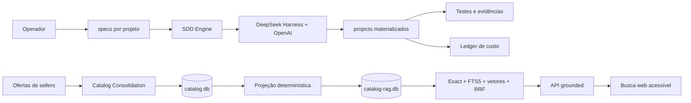
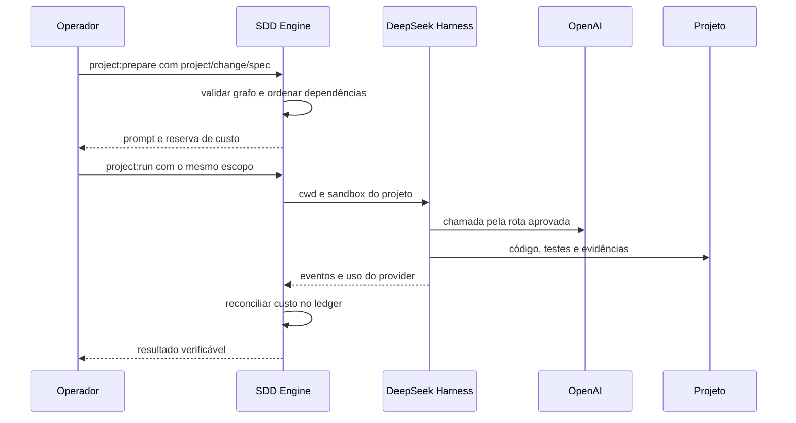
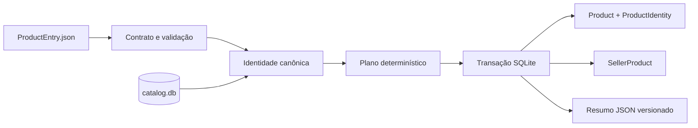
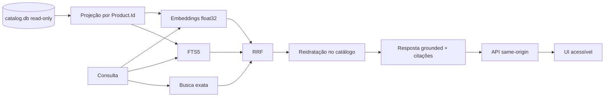

# VTEX Catalog Platform — SDD, consolidação e RAG

[](https://github.com/sergiofigueras/vtex-coding-challenge/actions/workflows/ci.yml?query=branch%3Amain)

Este repositório apresenta uma plataforma de catálogo construída com Spec Driven Development. A solução combina três elementos complementares:

- um engine reutilizável de entrega em [`engine/`](engine/), com DeepSeek Harness, OpenAI, validação, rastreabilidade e contabilidade de custo;
- especificações versionadas por projeto em [`specs/`](specs/), fonte canônica para criação e evolução das aplicações;
- áreas executáveis em `projects/<project-id>/`, materializadas a partir das specs e desenvolvidas em fatias SDD verificáveis.

Os dois projetos formam uma jornada única. O **Catalog Consolidation** transforma ofertas de vendedores em um catálogo SQLite consistente e idempotente. O **Catalog RAG** projeta esse catálogo em um sidecar de busca híbrida, reidrata resultados a partir da fonte de verdade e entrega respostas grounded com citações por uma API e uma interface web.

## Visão arquitetural



### Por que esta arquitetura é adequada

| Decisão | Valor entregue |
|---|---|
| Specs separadas por projeto | Cada produto possui fronteira, requisitos, dependências e critérios de aceitação próprios. |
| Engine compartilhado | Orquestração, segurança, custo e validação evoluem uma vez e atendem todos os projetos. |
| Consolidação determinística | A identidade de produto é explicável, versionada e reproduzível; reruns mantêm o catálogo estável. |
| Transação SQLite única | Migração, criação de produto e vínculo de seller formam uma operação atômica. |
| Catálogo como fonte de verdade | O RAG consulta o `catalog.db` em modo leitura e mantém artefatos derivados em um sidecar reconstruível. |
| Retrieval híbrido | Igualdade exata, FTS5 e similaridade vetorial cobrem intenção precisa e variações de linguagem; RRF combina os rankings. |
| Reidratação antes da resposta | Os vencedores retornam ao catálogo atual antes da geração, mantendo dados e citações alinhados. |
| API same-origin | Browser, assets e `/api/search` compartilham a mesma origem e mantêm configuração de provider no servidor. |
| Evidência por acceptance criterion | Cada mudança liga requisito, spec, teste, comando, resultado e custo. |
| IA no plano de engenharia | DeepSeek Harness e OpenAI implementam fatias delimitadas; o consolidador executa localmente de forma determinística. |

### Fronteiras de responsabilidade

```text
engine/
  config/                  rotas OpenAI, budgets e price books
  scripts/                 criação, validação, execução, custo e histórico
  .dsh/skills/             contrato de entrega usado pelo agente
  docs/sdd/                specs da infraestrutura
  cost/ledger.jsonl        ledger append-only por projeto e change ID

specs/
  catalog-consolidation/   fonte canônica das 12 specs do consolidador
  catalog-rag/             fonte canônica das 10 specs do RAG/API/UI

projects/
  <project-id>/            área executável materializada para código, testes e evidências
```

`specs/<project-id>` é a origem versionada. `projects/<project-id>` é a área de execução selecionada pelo engine. Essa separação permite revisar o contrato do produto antes de materializar código e mantém cada run confinado ao projeto escolhido.

## DeepSeek Harness, Cordis e OpenAI

[DeepSeek Harness](https://github.com/deepseek-ai/deepseek-harness) fornece o loop de agente, ferramentas, sessões duráveis e perfis headless. [Cordis](https://github.com/cordiverse/cordis) organiza esses componentes como serviços reativos com ciclo de vida reversível. O engine fixa a versão do Harness e aplica patches declarativos para selecionar rotas OpenAI:

- **default:** Terra com esforço médio, apropriado para implementação e testes;
- **economy:** Luna com esforço baixo, apropriado para tarefas mecânicas;
- **escalation:** Sol com aprovação e justificativa explícitas.



## Instalar as ferramentas necessárias

O fluxo usa Git, Node.js, npm, Python 3 com o módulo padrão `sqlite3` e `curl`. A versão recomendada é Node.js 24, compatível com o requisito do projeto (`^22.19.0 || >=24.0.0`). O npm acompanha o Node.js; as ferramentas JavaScript do engine, incluindo o DeepSeek Harness, são instaladas pelo `npm ci` na seção seguinte. Para executar `project:run`, configure também `OPENAI_API_KEY` no shell.

No macOS, instale as [Command Line Tools da Apple](https://docs.brew.sh/Installation) e o [Homebrew](https://brew.sh/) caso ainda não estejam disponíveis:

```bash
xcode-select --install
/bin/bash -c "$(curl -fsSL https://raw.githubusercontent.com/Homebrew/install/HEAD/install.sh)"
```

Ative o Homebrew no terminal atual e instale [Git](https://formulae.brew.sh/formula/git), [Node.js 24](https://formulae.brew.sh/formula/node@24) e [Python 3](https://docs.brew.sh/Homebrew-and-Python):

```bash
if [ -x /opt/homebrew/bin/brew ]; then
  eval "$(/opt/homebrew/bin/brew shellenv)"
else
  eval "$(/usr/local/bin/brew shellenv)"
fi
brew install git node@24 python3
export PATH="$(brew --prefix node@24)/bin:$PATH"
```

Confira a instalação antes de clonar o repositório (`curl` já acompanha o macOS):

```bash
git --version
node --version
npm --version
python3 --version
python3 -c 'import sqlite3; print(sqlite3.sqlite_version)'
curl --version
```

Em Linux ou Windows, obtenha as mesmas ferramentas nas páginas oficiais de [Node.js](https://nodejs.org/en/download), [Git](https://git-scm.com/downloads) e [Python](https://www.python.org/downloads/) e execute a mesma verificação de versões. No Windows, o [WSL](https://learn.microsoft.com/windows/wsl/install) oferece um terminal Linux para os comandos deste guia.

## Instalação do engine

```bash
git clone https://github.com/sergiofigueras/vtex-coding-challenge.git
cd vtex-coding-challenge
npm ci
npm run dsh:config
npm test
```

`dsh:config` resolve todos os perfis OpenAI e confirma a composição do Harness. Os testes do engine exercitam seleção de projeto, grafo SDD, budgets, retries, histórico, segurança e ledger.

## Materializar os projetos a partir de `specs/`

Em um clone limpo, crie a área executável e copie a fonte canônica de cada projeto:

```bash
npm run project:create -- \
  --id catalog-consolidation \
  --title "VTEX Catalog Consolidation"
cp -R specs/catalog-consolidation/. projects/catalog-consolidation/

npm run project:create -- \
  --id catalog-rag \
  --title "VTEX Catalog RAG Search UI"
cp -R specs/catalog-rag/. projects/catalog-rag/

npm run project:validate -- \
  --project catalog-consolidation --working-tree
npm run project:validate -- \
  --project catalog-rag --working-tree
npm run check
```

Para sincronizar uma área já materializada com a revisão atual das specs:

```bash
cp -R specs/catalog-consolidation/. projects/catalog-consolidation/
cp -R specs/catalog-rag/. projects/catalog-rag/
```

## Fluxo SDD compartilhado

Cada fatia usa um `change ID` estável e um conjunto explícito de specs. `prepare` cria o prompt dependency-ordered e a projeção de custo. `run` entrega esse mesmo escopo ao Harness.

```bash
run_sdd_slice() {
  project_id="$1"
  change_id="$2"
  spec_ids="$3"

  npm run project:prepare -- \
    --project "$project_id" \
    --change "$change_id" \
    --spec "$spec_ids" \
    --route default

  npm run project:run -- \
    --project "$project_id" \
    --change "$change_id" \
    --spec "$spec_ids" \
    --route default

  npm run project:validate -- \
    --project "$project_id" --working-tree
}
```

Após cada fatia:

```bash
npm --prefix "projects/<project-id>" run check
npm run check
npm run project:cost -- --project "<project-id>"
git diff --check
```

## Projeto 1 — Catalog Consolidation

### Objetivo e desenho

O consolidador recebe um JSON de ofertas e um catálogo SQLite. IDs de oferta têm escopo por seller. A identidade canônica versionada compara nome, marca e categoria após normalização explícita e aliases revisados. O serviço planeja o lote em memória e aplica migração, produtos e vínculos `SellerProduct` em uma transação.



Essa combinação preserva explicabilidade e segurança operacional: equivalências revisadas reutilizam o produto canônico, produtos distintos permanecem separados e ambiguidades produzem um resultado explícito com rollback integral.

### Grafo e ordem de entrega

As 12 specs estão em [`specs/catalog-consolidation/docs/sdd/specs/`](specs/catalog-consolidation/docs/sdd/specs/). O manifesto e a rastreabilidade recíproca ficam em:

- [`manifest.json`](specs/catalog-consolidation/docs/sdd/manifest.json)
- [`traceability.json`](specs/catalog-consolidation/docs/sdd/traceability.json)

```bash
run_sdd_slice catalog-consolidation catalog-one-foundation SDD-000,SDD-001
run_sdd_slice catalog-consolidation catalog-one-input SDD-002
run_sdd_slice catalog-consolidation catalog-one-schema SDD-003
run_sdd_slice catalog-consolidation catalog-one-identity SDD-004
run_sdd_slice catalog-consolidation catalog-one-consolidation SDD-005
run_sdd_slice catalog-consolidation catalog-one-safety SDD-006
run_sdd_slice catalog-consolidation catalog-one-verification SDD-007
run_sdd_slice catalog-consolidation catalog-one-operational-limits SDD-010
run_sdd_slice catalog-consolidation catalog-one-feature-existence-demo SDD-011
run_sdd_slice catalog-consolidation catalog-one-release SDD-008
run_sdd_slice catalog-consolidation catalog-one-history SDD-009
```

### Verificação e demonstração pública

Quando a implementação estiver materializada:

```bash
npm --prefix projects/catalog-consolidation ci
npm --prefix projects/catalog-consolidation run check
npm --prefix projects/catalog-consolidation run demo:feature
```

`demo:feature` cria dados sintéticos em diretório temporário, prova o dry run, aplica uma consolidação com um novo produto e três vínculos, consulta `Product` e `SellerProduct` e repete o lote com zero novas inserções.

Os oito casos focados também podem ser executados individualmente:

```bash
cd projects/catalog-consolidation
node --test test/hc-01-cross-seller-match.test.ts
node --test test/hc-02-seller-scoped-id.test.ts
node --test test/hc-03-normalized-variants.test.ts
node --test test/hc-04-potential-duplicate.test.ts
node --test test/hc-05-distinct-model.test.ts
node --test test/hc-06-ambiguous-rollback.test.ts
node --test test/hc-07-rerun-order.test.ts
node --test test/hc-08-hostile-text.test.ts
cd ../..
```

### Fontes pinadas e execução descartável

```bash
npm run project:sources -- --project catalog-consolidation
npm --prefix projects/catalog-consolidation run test:fixture
npm --prefix projects/catalog-consolidation run build

runtime_dir="$(mktemp -d)"
cp projects/catalog-consolidation/.sdd/inputs/catalog.db \
  "$runtime_dir/catalog.db"

node projects/catalog-consolidation/dist/cli.js \
  --input projects/catalog-consolidation/.sdd/inputs/ProductEntry.json \
  --database "$runtime_dir/catalog.db" \
  --dry-run \
  --format json

node projects/catalog-consolidation/dist/cli.js \
  --input projects/catalog-consolidation/.sdd/inputs/ProductEntry.json \
  --database "$runtime_dir/catalog.db" \
  --format json

node projects/catalog-consolidation/dist/cli.js \
  --input projects/catalog-consolidation/.sdd/inputs/ProductEntry.json \
  --database "$runtime_dir/catalog.db" \
  --format json
```

A execução usa uma cópia temporária do banco pinado. A segunda aplicação confirma a idempotência por meio do resumo JSON e das contagens do SQLite.

## Projeto 2 — Catalog RAG, API e UI

### Objetivo e desenho

O RAG projeta um documento por `Product.Id`, indexa os campos autorizados em um sidecar e combina três sinais de recuperação. O vencedor é reidratado a partir do catálogo antes da composição da resposta.



O sidecar `catalog-rag.db` contém documentos derivados, índice FTS, vetores e estado de build. A projeção ordenada e o hash de conteúdo permitem reindexação incremental. Fakes determinísticos sustentam testes offline; adapters configurados habilitam embeddings e respostas OpenAI em runtime.

### Grafo e ordem de entrega

As 10 specs estão em [`specs/catalog-rag/docs/sdd/specs/`](specs/catalog-rag/docs/sdd/specs/). A política de adapters runtime está documentada em [`engine-policy-prerequisite.md`](specs/catalog-rag/docs/sdd/engine-policy-prerequisite.md).

```bash
run_sdd_slice catalog-rag catalog-rag-foundation SDD-000,SDD-001
run_sdd_slice catalog-rag catalog-rag-index SDD-002
run_sdd_slice catalog-rag catalog-rag-retrieval SDD-003
run_sdd_slice catalog-rag catalog-rag-answer-api SDD-004,SDD-005
run_sdd_slice catalog-rag catalog-rag-search-ui SDD-006
run_sdd_slice catalog-rag catalog-rag-runtime-operations SDD-007
run_sdd_slice catalog-rag catalog-rag-causal-grounding-audit SDD-009
run_sdd_slice catalog-rag catalog-rag-release SDD-008
```

### Construir o catálogo consumido pelo RAG

```bash
npm run project:sources -- --project catalog-consolidation
npm --prefix projects/catalog-consolidation run build

mkdir -p projects/catalog-rag/.sdd/inputs
mkdir -p projects/catalog-rag/.sdd/runtime

cp projects/catalog-consolidation/.sdd/inputs/catalog.db \
  projects/catalog-rag/.sdd/inputs/catalog.db

node projects/catalog-consolidation/dist/cli.js \
  --input projects/catalog-consolidation/.sdd/inputs/ProductEntry.json \
  --database projects/catalog-rag/.sdd/inputs/catalog.db \
  --format json

node projects/catalog-consolidation/dist/cli.js \
  --input projects/catalog-consolidation/.sdd/inputs/ProductEntry.json \
  --database projects/catalog-rag/.sdd/inputs/catalog.db \
  --format json
```

### Indexar e servir

Após a implementação das specs correspondentes:

```bash
npm --prefix projects/catalog-rag ci
npm --prefix projects/catalog-rag run check

npm --prefix projects/catalog-rag run index -- \
  --catalog-db projects/catalog-rag/.sdd/inputs/catalog.db \
  --rag-db projects/catalog-rag/.sdd/runtime/catalog-rag.db

npm --prefix projects/catalog-rag run serve -- \
  --catalog-db projects/catalog-rag/.sdd/inputs/catalog.db \
  --rag-db projects/catalog-rag/.sdd/runtime/catalog-rag.db \
  --host 127.0.0.1 \
  --port 3000

open http://127.0.0.1:3000
```

O modo offline usa adapters determinísticos. O modo OpenAI recebe configuração no ambiente do processo:

```bash
read -s OPENAI_API_KEY
export OPENAI_API_KEY

npm --prefix projects/catalog-rag run index -- \
  --catalog-db projects/catalog-rag/.sdd/inputs/catalog.db \
  --rag-db projects/catalog-rag/.sdd/runtime/catalog-rag.db \
  --embedding-provider openai \
  --embedding-model '<modelo-fixado-pela-implementação>'

npm --prefix projects/catalog-rag run serve -- \
  --catalog-db projects/catalog-rag/.sdd/inputs/catalog.db \
  --rag-db projects/catalog-rag/.sdd/runtime/catalog-rag.db \
  --answer-provider openai \
  --answer-model '<modelo-fixado-pela-implementação>' \
  --host 127.0.0.1 \
  --port 3000

unset OPENAI_API_KEY
```

### API e experiência web

```bash
curl --fail-with-body http://127.0.0.1:3000/api/health

curl --fail-with-body \
  -H 'Content-Type: application/json' \
  -d '{"query":"Quais produtos Lenovo aparecem no catálogo?","topK":8}' \
  http://127.0.0.1:3000/api/search
```

O contrato de resposta preserva citações ligadas a `Product.Id`. A UI oferece estados de carregamento, resultados, resposta grounded, fontes e navegação por teclado.

## Segurança, privacidade e dados

- Fixtures baixadas permanecem em `.sdd/inputs/`, área ignorada pelo Git.
- Bancos operacionais e sidecars permanecem em `.sdd/runtime/`.
- Credenciais chegam por variáveis de ambiente ao processo autorizado.
- SQL usa parâmetros e transações.
- O browser recebe conteúdo de produto, resposta e citações pelo contrato HTTP.
- O consolidador registra métricas e códigos estáveis; o RAG registra retrieval, latência, provider e custo conforme `SDD-007`.
- Histórico portátil inclui somente artefatos revisados e sanitizados.

## Evidência, custo e gates

```bash
npm run project:validate -- --project catalog-consolidation --working-tree
npm run project:validate -- --project catalog-rag --working-tree
npm --prefix projects/catalog-consolidation run check
npm --prefix projects/catalog-rag run check
npm run check
npm run project:cost -- --project catalog-consolidation
npm run project:cost -- --project catalog-rag
git diff --check
git status --short --branch
```

O ledger em [`engine/cost/ledger.jsonl`](engine/cost/ledger.jsonl) associa cada reserva e settlement ao projeto, change ID, specs, rota, modelo e uso observado. A aplicação RAG também mede custo runtime de embeddings e respostas como telemetria própria.

## Criar uma nova mudança SDD

1. Escolha o próximo `SDD-NNN` e requisito `USR-NNN` livres no projeto.
2. Crie a spec em `specs/<project-id>/docs/sdd/specs/` com status `ready`.
3. Registre a spec no `manifest.json`.
4. Registre a autoridade e a propriedade recíproca no `traceability.json`.
5. Sincronize a área materializada em `projects/<project-id>/`.
6. Execute `project:validate`, `project:prepare`, `project:run` e os gates.
7. Mapeie cada acceptance criterion em `docs/sdd/evidence-index.md`.
8. Consulte o custo com `project:cost`.

Estrutura recomendada:

```markdown
# Título observável da mudança

Spec ID: `SDD-NNN`
Status: `ready`
Kind: product specification
Depends on: `SDD-...`

## Autoridade e intenção
## Requisitos
## Premissas
## Escopo
## Decisão técnica
## Critérios de aceitação
## Plano de prova
## Segurança e dados
## Custo
```

## Referências do repositório

- [Engine de entrega](engine/README.md)
- [Specs do Catalog Consolidation](specs/catalog-consolidation/README.md)
- [Specs do Catalog RAG](specs/catalog-rag/README.md)
- [Manifesto do Catalog Consolidation](specs/catalog-consolidation/docs/sdd/manifest.json)
- [Manifesto do Catalog RAG](specs/catalog-rag/docs/sdd/manifest.json)
