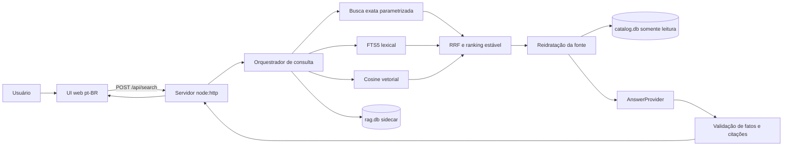
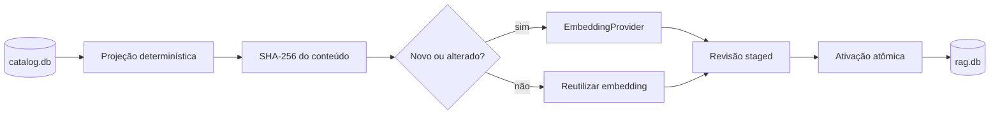

# VTEX Catalog RAG + API + UI — decisões de design e comandos SDD

> **Pré-requisito atualizado para `main`:** esta branch não contém mais `projects/catalog-consolidation` pronto. Execute primeiro [`README_VTEX_ONE.md`](README_VTEX_ONE.md) até concluir a criação e os gates do consolidator. As seções abaixo que instalam, testam ou usam esse projeto pressupõem essa etapa anterior.

Este documento é o guia completo para transformar o banco SQLite final do repositório [`sergiofigueras/vtex-coding-challenge`](https://github.com/sergiofigueras/vtex-coding-challenge) em um RAG com busca textual, resposta grounded, citações e interface web.

A implementação deve ser feita pelo framework SDD/DeepSeek Harness existente no repositório. O Codex foi usado apenas para elaborar e validar as specifications e este runbook; o código do RAG e da UI deve ser produzido pelos comandos `project:run` abaixo.

## Convenção portátil de paths

Execute este bloco uma vez em cada terminal antes dos demais comandos. O valor padrão corresponde ao layout recomendado, mas `ROOT_DIR` pode ser informado previamente quando o diretório estiver em outro local:

```bash
# Opcional: export ROOT_DIR="/path/absoluto/para/vtex-round-2"
export ROOT_DIR="${ROOT_DIR:-$HOME/Documents/vtex-round-2}"
export REPO_DIR="${ROOT_DIR}/vtex-coding-challenge"

mkdir -p "${ROOT_DIR}"
cd "${ROOT_DIR}"
```

Todos os paths absolutos deste guia são derivados de `ROOT_DIR` ou `REPO_DIR`. As aspas devem ser preservadas para que os comandos também funcionem quando algum componente do path contiver espaços.

## Estado verificado

- Repositório e remoto verificados em 2026-09-22.
- Branch de entrega: `main`; os comandos abaixo clonam essa branch diretamente e conferem o `HEAD` local contra `refs/heads/main` no remoto.
- Projeto especificado: `projects/catalog-rag`.
- Specs `SDD-000` a `SDD-009` no ZIP: estado inicial `ready`.
- Manifesto, critérios e rastreabilidade: validados pelo engine atual.
- Os sete comandos `project:prepare` originais foram executados com sucesso; `SDD-009` foi acrescentada depois e tem um comando próprio abaixo.
- Gate raiz: 48 de 48 testes do engine aprovados.
- RAG, API e UI: ainda não implementados; serão implementados pelo Harness.

O pacote está versionado na mesma branch [`main`](https://github.com/sergiofigueras/vtex-coding-challenge/blob/main/catalog-rag-ui-sdd-specs.zip). Depois do clone do passo 1, o arquivo já estará disponível em `${REPO_DIR}/catalog-rag-ui-sdd-specs.zip`; não é necessário buscar o arquivo em outra branch.

## Objetivo

Entregar um projeto independente que:

1. leia o `catalog.db` final sem modificá-lo;
2. projete um documento determinístico por produto;
3. gere embeddings incrementalmente;
4. mantenha documentos, FTS5, vetores e estado em um sidecar `rag.db`;
5. faça retrieval exato, lexical e semântico;
6. reidrate os resultados no banco original antes de responder;
7. gere respostas apenas com as evidências recuperadas;
8. valide todas as citações por `Product.Id`;
9. exponha uma API HTTP local;
10. ofereça uma UI acessível para busca em português e inglês;
11. funcione com fakes offline em todos os gates obrigatórios;
12. contabilize separadamente custo de desenvolvimento e custo runtime;
13. valide cada afirmação factual e comprove, por intervenção, que a resposta depende da evidência recuperada.

## Arquitetura



Fluxo de indexação:



## Fonte de dados

O projeto existente produz o banco final a partir de duas fontes pinadas:

- um `catalog.db` inicial;
- um `ProductEntry.json` com vínculos de sellers.

Contrato observado da fonte final:

| Tabela | Campos usados |
|---|---|
| `Product` | `Id`, `Name`, `Brand`, `Category` |
| `ProductIdentity` | `ProductId`, `CanonicalizationVersion`, `CanonicalName`, `CanonicalBrand`, `CanonicalCategory`, `CanonicalFingerprint` |
| `SellerProduct` | `Id`, `SellerName`, `ProductId`, `SellerProductId` |

Na fixture pinada atual, a consolidação final observada contém:

- 976 produtos;
- 976 identidades canônicas;
- 268 vínculos seller-produto;
- 20 sellers distintos.

Esses números são uma verificação da fixture atual, não uma regra de negócio. O RAG precisa funcionar com outras quantidades.

## Decisões de design

| ID | Decisão | Razão | Consequência ou trade-off |
|---|---|---|---|
| D-001 | Criar `projects/catalog-rag` como projeto independente. | `catalog-consolidation` tem contrato determinístico e model-free. | RAG não contamina o domínio do consolidator, mas requer instalação e gate próprios. |
| D-002 | Abrir `catalog.db` sempre em modo somente leitura. | Ele é a fonte de verdade final. | Migrações e estado RAG não podem ser armazenados nele. |
| D-003 | Usar `rag.db` como sidecar descartável. | Documentos, embeddings e FTS são dados derivados. | O índice pode ser reconstruído; sua atualização precisa detectar staleness. |
| D-004 | Criar um documento por `Product.Id`. | O catálogo é pequeno e seus fatos principais são product-scoped. | Consultas seller-scoped são representadas como evidência dentro do documento e metadados. |
| D-005 | Projetar nome, marca, categoria, campos canônicos e sellers ordenados. | Esses são os fatos realmente presentes no banco. | O sistema não pode inventar preço, estoque, descrição ou especificações. |
| D-006 | Calcular `contentHash` sobre JSON estável e versionado. | Permite indexação incremental reproduzível. | Mudança de versão de projeção invalida o estado compatível. |
| D-007 | Incluir tuplas de seller no hash. | `CanonicalFingerprint` não cobre alterações nos sellers. | Uma alteração de seller reindexa somente o produto afetado. |
| D-008 | Armazenar vetores como BLOB little-endian `float32`. | É simples, portátil e validável com `node:sqlite`. | Exige validação de tamanho, dimensão, finitude e norma. |
| D-009 | Usar cosine exato como baseline. | Cerca de mil produtos não justificam um serviço vetorial. | Escala linearmente; uma extensão vetorial exige benchmark e nova spec. |
| D-010 | Não tornar `sqlite-vec` obrigatório. | Adicionaria dependência nativa e compatibilidade runtime desnecessária. | Menos performance em catálogos grandes, mas instalação muito mais previsível. |
| D-011 | Combinar busca exata, FTS5 e semântica. | IDs/SKUs, termos literais e linguagem natural têm naturezas diferentes. | Cada canal precisa de testes e falhas independentes. |
| D-012 | Usar reciprocal-rank fusion, com `ProductId` como desempate. | Evita comparar scores incompatíveis entre canais. | Perde alguma calibragem fina, mas mantém ranking reproduzível. |
| D-013 | Consultas exatas de ID/SKU não chamam embedding. | Reduz latência, custo e pontos de falha. | O roteamento de identificadores precisa ser estrito. |
| D-014 | Reidratar os vencedores no `catalog.db`. | O índice pode estar desatualizado. | A consulta faz uma leitura adicional, mas não responde usando fatos obsoletos. |
| D-015 | Falhar fechado quando source fingerprint ou projeção estiverem incompatíveis. | Respostas sobre um índice stale não são confiáveis. | O operador precisa reconstruir o sidecar. |
| D-016 | Isolar `EmbeddingProvider` e `AnswerProvider` atrás de ports. | Mantém o core independente de fornecedor. | Adapters precisam declarar provider, model, dimensões e limites. |
| D-017 | Usar provedores falsos determinísticos nos testes. | CI e release não podem depender de rede, credenciais ou flutuação de modelo. | Smoke test real fica opt-in e não é release gate. |
| D-018 | Tratar pergunta, catálogo e saída do modelo como dados não confiáveis. | Campos podem conter prompt injection ou HTML. | Exige delimitação, schema estrito, limites e renderização segura. |
| D-019 | Validar citações depois da geração. | O modelo não é autoridade para identidade do produto. | Saída com citação desconhecida vira `answer_unavailable`. |
| D-020 | Ter abstention explícito. | Ausência de evidência não pode virar resposta inventada. | UI e API precisam diferenciar falta de evidência de falha do provedor. |
| D-021 | Servir API e UI na mesma origem. | Evita expor credenciais, banco ou CORS permissivo. | O backend também precisa servir assets estáticos allow-listed. |
| D-022 | Usar `node:http`, HTML, CSS e TypeScript sem framework inicialmente. | A UI é pequena e o repositório prioriza runtime enxuto. | Componentização é manual; framework futuro exige justificativa. |
| D-023 | Bind padrão em `127.0.0.1`. | O produto inicial é local e não possui autenticação. | Exposição pública fica fora de escopo. |
| D-024 | Renderizar valores com `textContent`, nunca `innerHTML`. | Produto, seller e resposta podem conter conteúdo hostil. | Formatação HTML gerada pelo modelo não é suportada. |
| D-025 | Não persistir query/history no browser. | Reduz risco de privacidade e escopo. | Não há histórico de conversa ou continuidade entre sessões. |
| D-026 | Implementar UI com oito estados explícitos. | Erros e degradações precisam ser compreensíveis. | A máquina de estados e os testes de UI ficam mais completos. |
| D-027 | Exigir WCAG 2.2 AA, teclado, foco e layout a 320 px. | A busca deve ser utilizável e verificável. | Browser tests e accessibility checks entram no gate. |
| D-028 | Aplicar limites antes de retrieval/modelo. | Protege custo, memória, concorrência e disponibilidade. | Requests fora do contrato são rejeitados cedo. |
| D-029 | Não registrar queries, prompts, evidências ou respostas brutas. | Esses dados podem conter conteúdo sensível. | Diagnóstico usa IDs opacos, contagens, estados e durações. |
| D-030 | Separar custo do Harness e custo runtime do RAG. | São atividades com autoridades e preços diferentes. | Dois relatórios precisam ser mantidos e nunca somados silenciosamente. |
| D-031 | Dividir implementação em oito changes SDD. | Mantém contexto, custo e autorização limitados. | Cada fatia exige prepare, run, revisão, gates e evidência. |
| D-032 | Criar SDD-097 como bootstrap de política do engine. | Há divergência entre o README raiz e a skill compartilhada sobre runtime com modelos. | Precisa de revisão humana porque o runner de projeto não pode editar `engine/`. |
| D-033 | Auditar suporte factual e dependência causal da evidência em SDD-009. | Uma citação válida isoladamente não prova que a resposta foi sustentada pelo RAG. | O gate testa afirmações contra o catálogo e compara mundos com evidência alterada, removida e irrelevante. |

## Modelo do sidecar

`SDD-001` exige estas estruturas conceituais:

| Estrutura | Responsabilidade |
|---|---|
| `RagIndexState` | geração, estado `building/ready/failed`, source fingerprint, versão de projeção e configuração de embedding |
| `RagDocument` | `ProductId`, conteúdo determinístico, `contentHash` e metadados filtráveis |
| `RagEmbedding` | `ProductId`, provider, model, dimensions, hash e vector BLOB |
| `RagDocumentFts` | índice FTS5 do texto projetado |
| `RagUsage` | uso runtime seguro e separado por indexação/query/resposta |

Regras:

- uma geração incompleta nunca se torna consultável;
- provider, model, dimensões e versão de projeção não podem ser misturados;
- chamadas de rede acontecem fora de transações SQLite de escrita;
- falha preserva a última geração `ready`;
- rerun sem alterações faz zero chamadas de embedding;
- produtos removidos desaparecem da nova geração;
- writers concorrentes são rejeitados por lock limitado;
- o source hash precisa continuar idêntico antes e depois da operação.

## Retrieval

O algoritmo esperado é:

1. validar e normalizar a query em Unicode NFC;
2. identificar consultas exatas de `Product.Id` ou seller SKU;
3. aplicar filtros exatos parametrizados de brand/category/seller;
4. executar FTS5 para correspondência lexical;
5. gerar embedding de query somente quando necessário;
6. calcular cosine contra os vetores da geração `ready`;
7. fundir rankings com RRF;
8. ordenar empate por `ProductId` ascendente;
9. limitar a 8 resultados por padrão e 20 no máximo;
10. reidratar produtos e sellers no banco original;
11. recusar resposta se o índice estiver stale ou incompatível;
12. enviar somente evidência reidratada e limitada ao gerador.

## Grounding e citações

Contrato conceitual do answer provider:

```ts
interface GroundedAnswer {
  answer: string | null;
  abstained: boolean;
  citationIds: string[];
}
```

Regras:

- citation IDs são criados pelo servidor, não pelo modelo;
- cada citação precisa corresponder a um resultado retornado;
- citação desconhecida, estrutura inválida ou HTML são rejeitados;
- falta de evidência retorna `insufficient_evidence` sem chamada desnecessária;
- falha do gerador retorna `answer_unavailable` preservando os produtos recuperados;
- não há loop ilimitado de reparo;
- o gerador não recebe caminho de banco, chave, SQL, tools ou configuração de provider.

## Contrato HTTP

### Health

```http
GET /api/health
```

Retorna `200` somente quando source, índice e configuração mínima estão prontos. Um índice `missing`, `building`, `stale`, `failed` ou `incompatible` retorna `503` sanitizado.

### Search

```http
POST /api/search
Content-Type: application/json
```

Request:

```json
{
  "query": "Quais notebooks Lenovo aparecem no catálogo?",
  "filters": {
    "brand": "Lenovo",
    "category": "Notebook",
    "seller": "Seller A"
  },
  "topK": 8
}
```

Response conceitual:

```json
{
  "schemaVersion": "1.0",
  "requestId": "opaque-id",
  "status": "answered",
  "answer": {
    "text": "Resposta baseada exclusivamente nos produtos recuperados.",
    "citationIds": ["product:123"]
  },
  "citations": [
    {
      "citationId": "product:123",
      "productId": 123
    }
  ],
  "results": [
    {
      "citationId": "product:123",
      "product": {
        "id": 123,
        "name": "Produto",
        "brand": "Marca",
        "category": "Categoria"
      },
      "sellers": [
        {
          "name": "Seller A",
          "sellerProductId": "SKU-001"
        }
      ],
      "match": {
        "rank": 1,
        "channels": ["lexical", "semantic"]
      }
    }
  ],
  "warnings": [],
  "timingsMs": {
    "retrieval": 0,
    "generation": 0,
    "total": 0
  }
}
```

Estados de sucesso:

- `answered`;
- `insufficient_evidence`;
- `answer_unavailable`.

Erros:

| HTTP | Uso |
|---|---|
| 400 | JSON inválido, campo desconhecido, query/filtro/topK inválido |
| 409 | índice stale ou incompatível |
| 413 | body acima de 16 KiB |
| 415 | media type não suportado |
| 429 | concorrência ou fila esgotada |
| 502 | resposta upstream inválida |
| 503 | índice/provider indisponível |
| 500 | falha inesperada sanitizada |

Limites iniciais:

- query: 2 a 500 code points;
- filtro: no máximo 256 code points;
- body HTTP: 16 KiB;
- `topK`: padrão 8, máximo 20;
- provider timeout: 30 segundos;
- retries: no máximo 1, apenas para falha documentada como transitória;
- gerações simultâneas: padrão 4;
- host: `127.0.0.1`.

Headers obrigatórios:

- `Cache-Control: no-store`;
- `X-Content-Type-Options: nosniff`;
- `Referrer-Policy: no-referrer`;
- Content Security Policy same-origin, sem inline script, objects, frames ou conexões cross-origin.

## Estados da UI

1. `checking-health`;
2. `ready-empty`;
3. `submitting`;
4. `answered`;
5. `insufficient-evidence`;
6. `answer-unavailable`;
7. `index-unavailable`;
8. `request-error`.

Cada card de resultado exibe somente valores enviados pela API:

- nome;
- `Product.Id`;
- marca ou `Não informada`;
- categoria ou `Não informada`;
- seller;
- seller product ID/SKU;
- canais de retrieval quando úteis.

Uma nova consulta cancela a anterior. Uma resposta antiga nunca pode sobrescrever a atual. Citações movem o foco para o card correspondente. A interface não usa cookies, local storage, analytics, histórico, SDK OpenAI, segredo, database path ou `innerHTML`.

## Grafo SDD

| Change ID | Specs implementadas | Dependências usadas como contexto |
|---|---|---|
| `catalog-rag-foundation` | SDD-000, SDD-001 | nenhuma |
| `catalog-rag-index` | SDD-002 | 000, 001 |
| `catalog-rag-retrieval` | SDD-003 | 000, 001, 002 |
| `catalog-rag-answer-api` | SDD-004, SDD-005 | 000 a 003 |
| `catalog-rag-search-ui` | SDD-006 | 000 a 005 |
| `catalog-rag-runtime-operations` | SDD-007 | 000 a 006 |
| `catalog-rag-causal-grounding-audit` | SDD-009 | 000 a 005 |
| `catalog-rag-release` | SDD-008 | 000 a 007, 009 |

## Comandos existentes hoje

Os comandos desta seção já existem no repositório no commit verificado.

### Ordem obrigatória

Os passos desta seção são sequenciais e cada passo pressupõe que os anteriores terminaram com sucesso. Em um checkout novo, comece pelo passo 1 e não copie um comando de validação isolado para antes das instalações. Em particular, os dois `npm ci` do passo 2 precisam terminar com sucesso antes de qualquer `npm run check`. O primeiro instala o workspace raiz e o engine; o segundo instala o consolidator.

### 1. Clonar e conferir requisitos

Este comando baixa diretamente a branch que contém este README e o ZIP. `${REPO_DIR}` não deve existir antes do clone; se já existir, use outro `ROOT_DIR` para um checkout limpo ou revise conscientemente o checkout existente.

```bash
git clone \
  --branch main \
  --single-branch \
  --depth 1 \
  https://github.com/sergiofigueras/vtex-coding-challenge.git \
  "${REPO_DIR}"
cd "${REPO_DIR}"

test "$(git branch --show-current)" = "main"
test -f "${REPO_DIR}/catalog-rag-ui-sdd-specs.zip"

LOCAL_SHA="$(git rev-parse HEAD)"
REMOTE_SHA="$(git ls-remote origin refs/heads/main | awk '{print $1}')"
test "${LOCAL_SHA}" = "${REMOTE_SHA}"

node --version
npm --version
```

O `--depth 1` é intencional e corresponde ao checkout usado pela CI. O validador SDD audita todos os commits visíveis; um clone com o histórico completo também expõe dois commits antigos de upload (`767bc1c` e `a5bb44d`) que não possuem trailer `Cost-Entry`, embora os arquivos atuais estejam válidos.

Node suportado pelo repositório:

```text
^22.19.0 || >=24.0.0
```

### Warnings experimentais do Node

Algumas versões suportadas do Node, como `22.19.0` e `24.0.0`, podem escrever avisos de Type Stripping e `node:sqlite` no `stderr`. Para manter o `stderr` dos comandos diretos reservado à aplicação, passe `--disable-warning=ExperimentalWarning` imediatamente depois de `node`:

```bash
node --disable-warning=ExperimentalWarning caminho/do/script.ts [...argumentos]
```

Quando a execução começar por `npm` e também precisar silenciar essa categoria nos processos Node descendentes, forneça a mesma opção por `NODE_OPTIONS` somente para o comando. Este é apenas o formato; execute os gates concretos somente depois das instalações do passo 2:

```bash
NODE_OPTIONS=--disable-warning=ExperimentalWarning npm <comando>
```

A opção silencia somente a categoria `ExperimentalWarning`; outros warnings e mensagens reais da aplicação continuam visíveis. Ela é uma opção do Node, não um argumento do `npm` nem do CLI de consolidação.

### 2. Instalar engine e consolidator antes dos gates

Execute o bloco inteiro. A cadeia `&&` impede que o build comece se uma das instalações falhar:

```bash
npm --prefix "${REPO_DIR}" ci &&
npm --prefix "${REPO_DIR}/projects/catalog-consolidation" ci &&
NODE_OPTIONS=--disable-warning=ExperimentalWarning npm --prefix "${REPO_DIR}" run check &&
NODE_OPTIONS=--disable-warning=ExperimentalWarning npm --prefix "${REPO_DIR}/projects/catalog-consolidation" run check
```

Erros TypeScript como `Cannot find name 'node:fs/promises'`, `Cannot find name 'node:sqlite'`, `Cannot find name 'process'` ou `Cannot find name 'Buffer'` indicam que o gate foi executado antes do `npm ci` raiz ou que essa instalação não terminou. Não corrija isso com um `npm install` avulso: volte ao início deste passo para preservar os lockfiles.

### 3. Criar o scaffold oficial do projeto

```bash
npm run project:create -- \
  --id catalog-rag \
  --title "VTEX Catalog RAG Search UI"
```

### 4. Validar e aplicar o pacote de specifications da mesma branch

O clone do passo 1 já baixou o ZIP binário junto com a branch `main`. Use diretamente esse arquivo local, valide o SHA-256 pinado e somente então descompacte-o:

```bash
BUNDLE_PATH="${REPO_DIR}/catalog-rag-ui-sdd-specs.zip"
BUNDLE_SHA256="88e8f4fefde82fa7410a6fa2b883f3607a3e3bf068a3bc2bb8f5413d2e8c15a6"

ACTUAL_BUNDLE_SHA256="$(shasum -a 256 "${BUNDLE_PATH}" | awk '{print $1}')" &&
test "${ACTUAL_BUNDLE_SHA256}" = "${BUNDLE_SHA256}" &&
unzip -t "${BUNDLE_PATH}" &&
unzip -o "${BUNDLE_PATH}" \
  -d "${REPO_DIR}"
```

Se qualquer etapa falhar, a cadeia `&&` impede a descompactação de um arquivo ausente, corrompido ou com conteúdo diferente do bundle validado.

Confira os arquivos:

```bash
find projects/catalog-rag \
  -path '*/.sdd' -prune \
  -o -type f -print \
  | sort
```

### 5. Validar manifesto e traceability

```bash
npm run project:validate -- \
  --project catalog-rag \
  --working-tree
```

O validador deve confirmar:

- IDs e paths únicos;
- dependências existentes e acíclicas;
- um marcador exato para cada acceptance criterion;
- ownership recíproco entre manifesto e traceability;
- sources permitidas;
- política de custos;
- ausência de credenciais.

### 6. Resolver o bootstrap SDD-097

Leia o documento completo:

```bash
sed -n '1,260p' \
  projects/catalog-rag/docs/sdd/engine-policy-prerequisite.md
```

Ele contém:

- requirement `ENG-USR-010`;
- manifest entry `SDD-097`;
- spec completa `97-model-enabled-product-runtime-policy.md`;
- texto da alteração da skill;
- acceptance criteria e proof plan.

Esse ajuste do engine é uma mudança humana revisada: o sandbox do runner só pode editar `projects/catalog-rag`. Depois de registrar e implementar a alteração conforme SDD-097:

```bash
npm run check
git diff --check
```

Não execute uma fatia que introduza provider real enquanto a divergência estiver aberta.

### 7. Disponibilizar a chave somente para o Harness

`project:prepare` não usa modelo. Antes de `project:run`, forneça a chave no ambiente sem gravá-la em arquivo ou comando:

```bash
while [ -z "${OPENAI_API_KEY:-}" ]; do
  printf 'Cole OPENAI_API_KEY e pressione Enter (a chave não será exibida): ' >&2
  IFS= read -r -s OPENAI_API_KEY
  printf '\n' >&2
done
export OPENAI_API_KEY
```

### 8. Preparar e executar SDD-000 + SDD-001

```bash
npm run project:prepare -- \
  --project catalog-rag \
  --change catalog-rag-foundation \
  --spec SDD-000,SDD-001 \
  --route default

find projects/catalog-rag/.sdd/runs \
  -name prompt.md \
  -print \
  | sort

npm run project:run -- \
  --project catalog-rag \
  --change catalog-rag-foundation \
  --spec SDD-000,SDD-001 \
  --route default
```

### 9. Gates da fundação

```bash
npm run project:validate -- \
  --project catalog-rag \
  --working-tree

npm --prefix projects/catalog-rag run check
npm run check
git diff --check

npm run project:cost -- \
  --project catalog-rag
```

Depois que essa fatia criar `package-lock.json` e os scripts reais:

```bash
npm --prefix projects/catalog-rag ci
npm --prefix projects/catalog-rag run check
```

### 10. Preparar e executar SDD-002

```bash
npm run project:prepare -- \
  --project catalog-rag \
  --change catalog-rag-index \
  --spec SDD-002 \
  --route default

npm run project:run -- \
  --project catalog-rag \
  --change catalog-rag-index \
  --spec SDD-002 \
  --route default

npm run project:validate -- --project catalog-rag --working-tree
npm --prefix projects/catalog-rag run check
npm run check
git diff --check
npm run project:cost -- --project catalog-rag
```

### 11. Preparar e executar SDD-003

```bash
npm run project:prepare -- \
  --project catalog-rag \
  --change catalog-rag-retrieval \
  --spec SDD-003 \
  --route default

npm run project:run -- \
  --project catalog-rag \
  --change catalog-rag-retrieval \
  --spec SDD-003 \
  --route default

npm run project:validate -- --project catalog-rag --working-tree
npm --prefix projects/catalog-rag run check
npm run check
git diff --check
npm run project:cost -- --project catalog-rag
```

### 12. Preparar e executar SDD-004 + SDD-005

```bash
npm run project:prepare -- \
  --project catalog-rag \
  --change catalog-rag-answer-api \
  --spec SDD-004,SDD-005 \
  --route default

npm run project:run -- \
  --project catalog-rag \
  --change catalog-rag-answer-api \
  --spec SDD-004,SDD-005 \
  --route default

npm run project:validate -- --project catalog-rag --working-tree
npm --prefix projects/catalog-rag run check
npm run check
git diff --check
npm run project:cost -- --project catalog-rag
```

### 13. Preparar e executar SDD-006

```bash
npm run project:prepare -- \
  --project catalog-rag \
  --change catalog-rag-search-ui \
  --spec SDD-006 \
  --route default

npm run project:run -- \
  --project catalog-rag \
  --change catalog-rag-search-ui \
  --spec SDD-006 \
  --route default

npm run project:validate -- --project catalog-rag --working-tree
npm --prefix projects/catalog-rag run check
npm run check
git diff --check
npm run project:cost -- --project catalog-rag
```

### 14. Preparar e executar SDD-007

```bash
npm run project:prepare -- \
  --project catalog-rag \
  --change catalog-rag-runtime-operations \
  --spec SDD-007 \
  --route default

npm run project:run -- \
  --project catalog-rag \
  --change catalog-rag-runtime-operations \
  --spec SDD-007 \
  --route default

npm run project:validate -- --project catalog-rag --working-tree
npm --prefix projects/catalog-rag run check
npm run check
git diff --check
npm run project:cost -- --project catalog-rag
```

### 15. Preparar e executar SDD-009

O fact-check compara afirmações com os campos reidratados do catálogo e verifica causalidade em mundos com evidência alterada, removida e irrelevante. Execute esta fatia antes de `SDD-008`, que depende dela.

```bash
npm run project:prepare -- \
  --project catalog-rag \
  --change catalog-rag-causal-grounding-audit \
  --spec SDD-009 \
  --route default

npm run project:run -- \
  --project catalog-rag \
  --change catalog-rag-causal-grounding-audit \
  --spec SDD-009 \
  --route default

npm run project:validate -- --project catalog-rag --working-tree
npm --prefix projects/catalog-rag run check
npm run check
git diff --check
npm run project:cost -- --project catalog-rag
```

### 16. Preparar e executar SDD-008

```bash
npm run project:prepare -- \
  --project catalog-rag \
  --change catalog-rag-release \
  --spec SDD-008 \
  --route default

npm run project:run -- \
  --project catalog-rag \
  --change catalog-rag-release \
  --spec SDD-008 \
  --route default

npm run project:validate -- --project catalog-rag --working-tree
npm --prefix projects/catalog-rag run check
npm run check
git diff --check
npm run project:cost -- --project catalog-rag
```

### 17. Rate-limit fallback

Use somente quando o runner classificar a falha como rate limit HTTP 429. Repita exatamente projeto, change ID e specs:

```bash
npm run project:run -- \
  --project catalog-rag \
  --change catalog-rag-answer-api \
  --spec SDD-004,SDD-005 \
  --route default \
  --rate-limit-fallback economy
```

Não use esse fallback para teste quebrado, erro de implementação ou conflito de specification.

A rota de escalation só é válida com autorização explícita:

```bash
npm run project:run -- \
  --project catalog-rag \
  --change '<change-id>' \
  --spec '<SDD-ID>' \
  --route escalation \
  --approve-escalation \
  --escalation-reason '<justificativa revisada>'
```

### 18. Remover a chave do shell

```bash
unset OPENAI_API_KEY
```

## Construção do banco final

Os comandos abaixo criam uma cópia final descartável. Eles não alteram o banco pinado em `.sdd/inputs` do consolidator.

```bash
npm --prefix projects/catalog-consolidation run sources:ingest

mkdir -p projects/catalog-rag/.sdd/inputs
mkdir -p projects/catalog-rag/.sdd/runtime

cp -- \
  projects/catalog-consolidation/.sdd/inputs/catalog.db \
  projects/catalog-rag/.sdd/inputs/catalog.db

node --disable-warning=ExperimentalWarning projects/catalog-consolidation/src/cli.ts \
  --input projects/catalog-consolidation/.sdd/inputs/ProductEntry.json \
  --database projects/catalog-rag/.sdd/inputs/catalog.db \
  --format json

# Segunda execução intencional: deve informar zero inserts.
node --disable-warning=ExperimentalWarning projects/catalog-consolidation/src/cli.ts \
  --input projects/catalog-consolidation/.sdd/inputs/ProductEntry.json \
  --database projects/catalog-rag/.sdd/inputs/catalog.db \
  --format json
```

Verifique schema, foreign keys e contagens:

```bash
sqlite3 projects/catalog-rag/.sdd/inputs/catalog.db <<'SQL'
PRAGMA foreign_key_check;
SELECT 'Product', COUNT(*) FROM Product;
SELECT 'ProductIdentity', COUNT(*) FROM ProductIdentity;
SELECT 'SellerProduct', COUNT(*) FROM SellerProduct;
SELECT 'Sellers', COUNT(DISTINCT SellerName) FROM SellerProduct;
SQL
```

Registre o hash da cópia final antes do RAG:

```bash
CATALOG_DB_PATH='projects/catalog-rag/.sdd/inputs/catalog.db'
CATALOG_HASH_BEFORE="$(shasum -a 256 "$CATALOG_DB_PATH" | awk '{print $1}')"
printf '%s\n' "$CATALOG_HASH_BEFORE"
```

Não use o hash do banco original como identidade da cópia final: a consolidação altera os bytes.

## Comandos-alvo do produto implementado

Esta seção é sequencial: só indexe depois de criar o `catalog.db` no passo anterior e de o `check` terminar sem erro; só inicie o servidor depois de o índice terminar. Execute os comandos a partir do checkout e mantenha os paths absolutos derivados de `ROOT_DIR`, pois `npm --prefix` executa o script com o diretório do pacote como `cwd`.

Os IDs estão pinados, sem placeholders: `text-embedding-3-small` com 1536 dimensões para embeddings e `gpt-5.6-terra` para respostas.

### 1. Instalar e verificar o projeto

```bash
cd "${REPO_DIR}"
npm --prefix "${REPO_DIR}/projects/catalog-rag" ci
npm --prefix "${REPO_DIR}/projects/catalog-rag" run check
```

### 2. Criar ou atualizar o índice

Escolha exatamente uma das opções abaixo. Não execute os dois modos em sequência, porque cada configuração de embedding exige seu próprio rebuild completo do sidecar.

Opção A — offline, sem chave e sem chamadas externas:

```bash
npm --prefix "${REPO_DIR}/projects/catalog-rag" run index -- \
  --catalog-db "${REPO_DIR}/projects/catalog-rag/.sdd/inputs/catalog.db" \
  --rag-db "${REPO_DIR}/projects/catalog-rag/.sdd/runtime/rag.db" \
  --embedding-provider offline-deterministic \
  --embedding-model deterministic-v1 \
  --embedding-dimensions 8
```

Opção B — OpenAI. Cole uma chave não vazia quando o prompt aparecer. Nada será exibido enquanto você digita; isso é o comportamento esperado de `read -s`. O laço impede continuar com uma chave vazia:

```bash
while [ -z "${OPENAI_API_KEY:-}" ]; do
  printf 'Cole OPENAI_API_KEY e pressione Enter (a chave não será exibida): ' >&2
  IFS= read -r -s OPENAI_API_KEY
  printf '\n' >&2
done
export OPENAI_API_KEY

npm --prefix "${REPO_DIR}/projects/catalog-rag" run index -- \
  --catalog-db "${REPO_DIR}/projects/catalog-rag/.sdd/inputs/catalog.db" \
  --rag-db "${REPO_DIR}/projects/catalog-rag/.sdd/runtime/rag.db" \
  --embedding-provider openai \
  --embedding-model text-embedding-3-small \
  --embedding-dimensions 1536
```

O índice precisa registrar provider, model, dimensions, projection version, source fingerprint e content hash. Troca de qualquer valor incompatível exige nova geração; nunca misture embeddings.

### 3. Verificar que o source continua intacto

```bash
CATALOG_DB_PATH="${REPO_DIR}/projects/catalog-rag/.sdd/inputs/catalog.db"
CATALOG_HASH_AFTER="$(shasum -a 256 "${CATALOG_DB_PATH}" | awk '{print $1}')"
test "${CATALOG_HASH_BEFORE}" = "${CATALOG_HASH_AFTER}"
```

### 4. Iniciar API e UI

Use somente o comando correspondente à opção escolhida no índice.

Opção A — offline:

```bash
npm --prefix "${REPO_DIR}/projects/catalog-rag" run serve -- \
  --catalog-db "${REPO_DIR}/projects/catalog-rag/.sdd/inputs/catalog.db" \
  --rag-db "${REPO_DIR}/projects/catalog-rag/.sdd/runtime/rag.db" \
  --embedding-provider offline-deterministic \
  --embedding-model deterministic-v1 \
  --embedding-dimensions 8 \
  --answer-provider offline-deterministic \
  --answer-model grounded-fake \
  --host 127.0.0.1 \
  --port 3000
```

Opção B — OpenAI:

```bash
npm --prefix "${REPO_DIR}/projects/catalog-rag" run serve -- \
  --catalog-db "${REPO_DIR}/projects/catalog-rag/.sdd/inputs/catalog.db" \
  --rag-db "${REPO_DIR}/projects/catalog-rag/.sdd/runtime/rag.db" \
  --embedding-provider openai \
  --embedding-model text-embedding-3-small \
  --embedding-dimensions 1536 \
  --answer-provider openai \
  --answer-model gpt-5.6-terra \
  --host 127.0.0.1 \
  --port 3000
```

O provider/model/dimensões de embedding no `serve` deve ser exatamente o mesmo usado no `index`.

Abra a UI:

```bash
open http://127.0.0.1:3000
```

### 5. Testar health e busca

```bash
curl --fail-with-body \
  http://127.0.0.1:3000/api/health

curl --fail-with-body \
  -H 'Content-Type: application/json' \
  -d '{"query":"Quais produtos Lenovo aparecem no catálogo?","topK":8}' \
  http://127.0.0.1:3000/api/search
```

Teste com filtros:

```bash
curl --fail-with-body \
  -H 'Content-Type: application/json' \
  -d '{"query":"notebook","filters":{"brand":"Lenovo"},"topK":8}' \
  http://127.0.0.1:3000/api/search
```

Teste de validação:

```bash
curl --fail-with-body \
  -H 'Content-Type: application/json' \
  -d '{"query":"","topK":999}' \
  http://127.0.0.1:3000/api/search
```

### 6. Encerrar exposição da chave

Depois de parar o servidor:

```bash
unset OPENAI_API_KEY
```

## Gates e evidências

O `check` final do projeto deve executar:

- strict TypeScript;
- lint/format;
- unit tests;
- integração SQLite;
- testes do índice incremental;
- retrieval exato, FTS5, cosine e RRF;
- grounding, abstention e citações;
- contrato HTTP;
- testes de browser;
- acessibilidade;
- build de produção;
- secret scan;
- SDD validation.

Comandos finais:

```bash
npm --prefix projects/catalog-rag run check
npm run project:validate -- --project catalog-rag --working-tree
npm run check
git diff --check
npm run project:cost -- --project catalog-rag
```

O evidence index fica em:

```text
projects/catalog-rag/docs/sdd/evidence-index.md
```

Cada acceptance criterion deve apontar para comando, exit status, artefato relevante e data. Status só muda de `ready` para `implemented` ou `verified` quando houver evidência correspondente.

## Evaluation set

O conjunto offline versionado precisa conter:

- português e inglês;
- `Product.Id` exato;
- seller product ID/SKU exato;
- filtros de brand/category/seller;
- termos lexicais;
- linguagem semântica;
- Unicode;
- zero-result;
- campos solicitados mas inexistentes;
- ambiguidade;
- conteúdo em formato de prompt injection.

Métricas obrigatórias:

- recall@1, recall@5 e recall@8;
- reciprocal rank;
- zero-result correctness;
- citation precision;
- citation coverage;
- abstention correctness;
- degraded-state correctness;
- index idempotence;
- latência com providers falsos.

Um LLM judge não pode ser o único oracle de release.

## Custos

Dois domínios separados:

```text
engine/cost/ledger.jsonl
  custo do OpenAI/Harness para implementar o software

projects/catalog-rag/.sdd/runtime/
  custo de indexação, embedding de query e geração de resposta
```

Relatório de delivery:

```bash
npm run project:cost -- --project catalog-rag
```

O relatório runtime é responsabilidade de SDD-007. Quando provider não informar uso ou preço, registre `unavailable`; nunca invente zero.

## Revisão e commits

O agente interno não deve fazer commit ou push. O operador revisa mudanças, evidência e custo. Cada commit não-merge precisa de um `Cost-Entry` conhecido.

Exemplo para uma fatia concluída e revisada:

```bash
git status --short
git diff --check
npm --prefix projects/catalog-rag run check
npm run check
npm run project:cost -- --project catalog-rag

git add projects/catalog-rag engine/cost/ledger.jsonl
git commit \
  -m "Implement catalog RAG foundation" \
  -m "Cost-Entry: catalog-rag-foundation"
```

Use no trailer exatamente o change ID registrado no ledger da execução correspondente. Não copie esse exemplo se a execução criou outro change ID.

## Segurança

- Nunca comitar `.env`, chave, banco, WAL, journal, vetores ou run artifacts.
- Nunca passar API key como argumento CLI.
- Nunca mandar database path, prompt, SQL ou provider payload ao browser.
- Sempre parametrizar valores SQL.
- Nunca logar query, evidência, resposta, IP ou stack trace por padrão.
- Tratar campos do catálogo como conteúdo hostil.
- Validar saída do provider com schema fechado.
- Limitar bytes, strings, topK, evidência, output, timeout, retry, fila e concorrência.
- Propagar `AbortSignal` em disconnect, timeout e shutdown.
- Desabilitar CORS permissivo.
- Servir apenas assets allow-listed.
- Bloquear traversal e não transformar `/api/*` em fallback HTML.
- Manter o servidor em loopback até existir spec de autenticação/deployment.

## Observabilidade

Eventos estruturados podem conter:

- timestamp;
- request/build ID opaco;
- nome do estágio;
- estado ou error code estável;
- duração;
- quantidade de resultados;
- provider/model não sensível;
- uso informado pelo provider.

Não podem conter:

- chave;
- query completa;
- conteúdo projetado;
- evidência;
- resposta;
- vetor;
- payload completo de provider;
- IP;
- caminho absoluto local.

## Troubleshooting

### TypeScript não encontra `node:fs/promises`, `node:sqlite`, `process` ou `Buffer`

O check do consolidator foi iniciado antes de completar a instalação sequencial. Execute novamente as duas instalações, na ordem, e só então repita o gate:

```bash
npm --prefix "${REPO_DIR}" ci &&
npm --prefix "${REPO_DIR}/projects/catalog-consolidation" ci &&
NODE_OPTIONS=--disable-warning=ExperimentalWarning npm --prefix "${REPO_DIR}/projects/catalog-consolidation" run check
```

Não use `npm install @types/node` como correção ad hoc, pois isso altera o estado governado pelos lockfiles e mascara a etapa ausente.

### `project:create` informa que o projeto existe

Não use uma flag `--force`, pois ela não existe. Confirme que `projects/catalog-rag` é somente o scaffold esperado antes de substituí-lo pelo bundle.

### `project:validate` falha

```bash
npm run project:validate -- \
  --project catalog-rag \
  --working-tree
```

Confira:

- `Spec ID` exato em cada arquivo;
- cada `**AC-NNN-NN:**` exatamente uma vez;
- dependências registradas;
- requirement ownership nos dois sentidos;
- apenas authorities aceitas;
- ausência de campos JSON extras.

### `npm run check` raiz passa, mas o projeto falha

Isso é esperado como possibilidade: o projeto não pertence ao workspace npm raiz. Rode também:

```bash
npm --prefix projects/catalog-rag ci
npm --prefix projects/catalog-rag run check
```

### Índice stale ou incompatível

Não responda usando o conteúdo antigo. Reexecute o comando `index` com a mesma configuração ou faça rebuild explícito documentado pela implementação.

### Provider indisponível

- Preserve resultados exatos/lexicais quando seguros.
- Retorne warning estável para semantic retrieval indisponível.
- Retorne `answer_unavailable` quando apenas a geração falhar.
- Não substitua por texto inventado.

### Banco mudou durante build

Falhe a geração staged, preserve a última revisão `ready`, feche handles e reconstrua usando uma cópia estável do banco final.

### HTTP 429 no Harness

Use `--rate-limit-fallback economy` somente na mesma combinação project/change/spec que recebeu a classificação de rate limit.

### Custo não disponível

Registre como `unavailable`. Zero significa custo comprovadamente zero, não ausência de medição.

## Non-goals

- modificar o consolidator;
- alterar ou migrar o `catalog.db` final;
- deduplicação fuzzy de identidade;
- compra, preço, estoque ou disponibilidade;
- chat history;
- autenticação ou multi-tenancy;
- exposição pública;
- streaming de resposta;
- analytics;
- armazenamento de queries;
- vector database remoto;
- `sqlite-vec` obrigatório;
- geração de fatos ausentes no banco.

## Limitações do conteúdo

O catálogo disponível contém essencialmente nome, marca, categoria, identidade canônica e sellers/SKUs. Embeddings ajudam a encontrar produtos por texto semelhante, mas não adicionam descrições, características, preço, estoque, compatibilidade ou avaliações.

Uma resposta correta deve dizer que a informação não está disponível quando a pergunta pedir algo fora desses campos.

## Arquivos entregues

```text
projects/catalog-rag/
  AGENTS.md
  README.md
  package.json
  project.json
  config/sources.json
  docs/adr/0001-read-only-sidecar-and-same-origin-ui.md
  docs/sdd/engine-policy-prerequisite.md
  docs/sdd/evidence-index.md
  docs/sdd/manifest.json
  docs/sdd/traceability.json
  docs/sdd/specs/00-authority-boundary-and-user-journey.md
  docs/sdd/specs/01-read-only-projection-and-sidecar-schema.md
  docs/sdd/specs/02-embedding-providers-and-incremental-index.md
  docs/sdd/specs/03-hybrid-retrieval-and-rehydration.md
  docs/sdd/specs/04-grounded-generation-and-citations.md
  docs/sdd/specs/05-same-origin-http-api.md
  docs/sdd/specs/06-accessible-text-search-ui.md
  docs/sdd/specs/07-security-observability-and-runtime-cost.md
  docs/sdd/specs/08-evaluation-verification-and-delivery.md
```

## Paths derivados de `ROOT_DIR`

Os paths abaixo são expressos pelas variáveis configuradas no início deste README. Assim, os comandos não dependem de um diretório pessoal específico nem do diretório corrente do shell.

### Raízes

```text
Workspace:
"${ROOT_DIR}"

Repositório:
"${REPO_DIR}"

Engine SDD:
"${REPO_DIR}/engine"

Projeto consolidator:
"${REPO_DIR}/projects/catalog-consolidation"

Projeto RAG:
"${REPO_DIR}/projects/catalog-rag"

Artefatos entregues:
"${ROOT_DIR}/README.md"
"${ROOT_DIR}/catalog-rag-ui-sdd-runbook.md"
"${REPO_DIR}/catalog-rag-ui-sdd-specs.zip"
```

### Arquivos SDD existentes do projeto RAG

```text
"${REPO_DIR}/projects/catalog-rag/AGENTS.md"
"${REPO_DIR}/projects/catalog-rag/README.md"
"${REPO_DIR}/projects/catalog-rag/package.json"
"${REPO_DIR}/projects/catalog-rag/project.json"
"${REPO_DIR}/projects/catalog-rag/config/sources.json"
"${REPO_DIR}/projects/catalog-rag/docs/adr/0001-read-only-sidecar-and-same-origin-ui.md"
"${REPO_DIR}/projects/catalog-rag/docs/sdd/engine-policy-prerequisite.md"
"${REPO_DIR}/projects/catalog-rag/docs/sdd/evidence-index.md"
"${REPO_DIR}/projects/catalog-rag/docs/sdd/manifest.json"
"${REPO_DIR}/projects/catalog-rag/docs/sdd/traceability.json"
"${REPO_DIR}/projects/catalog-rag/docs/sdd/specs/00-authority-boundary-and-user-journey.md"
"${REPO_DIR}/projects/catalog-rag/docs/sdd/specs/01-read-only-projection-and-sidecar-schema.md"
"${REPO_DIR}/projects/catalog-rag/docs/sdd/specs/02-embedding-providers-and-incremental-index.md"
"${REPO_DIR}/projects/catalog-rag/docs/sdd/specs/03-hybrid-retrieval-and-rehydration.md"
"${REPO_DIR}/projects/catalog-rag/docs/sdd/specs/04-grounded-generation-and-citations.md"
"${REPO_DIR}/projects/catalog-rag/docs/sdd/specs/05-same-origin-http-api.md"
"${REPO_DIR}/projects/catalog-rag/docs/sdd/specs/06-accessible-text-search-ui.md"
"${REPO_DIR}/projects/catalog-rag/docs/sdd/specs/07-security-observability-and-runtime-cost.md"
"${REPO_DIR}/projects/catalog-rag/docs/sdd/specs/08-evaluation-verification-and-delivery.md"
"${REPO_DIR}/projects/catalog-rag/docs/sdd/specs/09-causal-grounding-and-fact-check-audit.md"
```

### Arquivos do engine envolvidos no bootstrap SDD-097

Arquivos existentes que precisam ser revisados ou alterados:

```text
"${REPO_DIR}/engine/docs/sdd/manifest.json"
"${REPO_DIR}/engine/docs/sdd/traceability.json"
"${REPO_DIR}/engine/.dsh/skills/sdd-delivery/SKILL.md"
```

Arquivos que SDD-097 deve criar:

```text
"${REPO_DIR}/engine/docs/sdd/specs/97-model-enabled-product-runtime-policy.md"
"${REPO_DIR}/engine/test/model-runtime-policy.test.mjs"
```

Documento que contém o conteúdo exato da mudança:

```text
"${REPO_DIR}/projects/catalog-rag/docs/sdd/engine-policy-prerequisite.md"
```

### Inputs e bancos

Fontes pinadas e ignoradas do consolidator:

```text
"${REPO_DIR}/projects/catalog-consolidation/.sdd/inputs/ProductEntry.json"
"${REPO_DIR}/projects/catalog-consolidation/.sdd/inputs/catalog.db"
"${REPO_DIR}/projects/catalog-consolidation/.sdd/inputs/inventory.json"
```

Cópia final que o RAG deve ler sem alterar:

```text
"${REPO_DIR}/projects/catalog-rag/.sdd/inputs/catalog.db"
```

Sidecar e registros runtime que a implementação deve criar:

```text
"${REPO_DIR}/projects/catalog-rag/.sdd/runtime/rag.db"
"${REPO_DIR}/projects/catalog-rag/.sdd/runtime/runtime-usage.jsonl"
"${REPO_DIR}/projects/catalog-rag/.sdd/runtime/evaluation-results.json"
"${REPO_DIR}/projects/catalog-rag/.sdd/runtime/browser-artifacts/"
```

Todos os paths sob `.sdd/` são privados e ignorados pelo Git.

### Paths de implementação que o Harness deve materializar

Este layout passa a ser o contrato de organização recomendado por este README. Caso o Harness proponha outro path, a mudança deve ser justificada na evidência da spec correspondente e todos os comandos/documentos precisam ser atualizados de forma atômica.

Arquivos de configuração e build:

```text
"${REPO_DIR}/projects/catalog-rag/package-lock.json"
"${REPO_DIR}/projects/catalog-rag/tsconfig.json"
"${REPO_DIR}/projects/catalog-rag/.env.example"
```

Entrypoint e domínio:

```text
"${REPO_DIR}/projects/catalog-rag/src/cli.ts"
"${REPO_DIR}/projects/catalog-rag/src/domain/types.ts"
"${REPO_DIR}/projects/catalog-rag/src/domain/errors.ts"
"${REPO_DIR}/projects/catalog-rag/src/domain/projection.ts"
"${REPO_DIR}/projects/catalog-rag/src/domain/ranking.ts"
"${REPO_DIR}/projects/catalog-rag/src/domain/citations.ts"
```

Application services e ports:

```text
"${REPO_DIR}/projects/catalog-rag/src/application/ports.ts"
"${REPO_DIR}/projects/catalog-rag/src/application/build-index.ts"
"${REPO_DIR}/projects/catalog-rag/src/application/search-catalog.ts"
"${REPO_DIR}/projects/catalog-rag/src/application/answer-query.ts"
```

Adapters SQLite:

```text
"${REPO_DIR}/projects/catalog-rag/src/adapters/sqlite/catalog-reader.ts"
"${REPO_DIR}/projects/catalog-rag/src/adapters/sqlite/rag-store.ts"
"${REPO_DIR}/projects/catalog-rag/src/adapters/sqlite/migrations.ts"
```

Adapters de provider e testes offline:

```text
"${REPO_DIR}/projects/catalog-rag/src/adapters/providers/openai-embedding-provider.ts"
"${REPO_DIR}/projects/catalog-rag/src/adapters/providers/openai-answer-provider.ts"
"${REPO_DIR}/projects/catalog-rag/src/adapters/providers/fake-embedding-provider.ts"
"${REPO_DIR}/projects/catalog-rag/src/adapters/providers/fake-answer-provider.ts"
"${REPO_DIR}/projects/catalog-rag/src/adapters/usage/jsonl-usage-recorder.ts"
```

Servidor:

```text
"${REPO_DIR}/projects/catalog-rag/src/server/http-server.ts"
"${REPO_DIR}/projects/catalog-rag/src/server/api.ts"
"${REPO_DIR}/projects/catalog-rag/src/server/static-files.ts"
```

UI:

```text
"${REPO_DIR}/projects/catalog-rag/src/web/index.html"
"${REPO_DIR}/projects/catalog-rag/src/web/app.ts"
"${REPO_DIR}/projects/catalog-rag/src/web/styles.css"
```

Evals e testes:

```text
"${REPO_DIR}/projects/catalog-rag/eval/catalog-rag-eval.json"
"${REPO_DIR}/projects/catalog-rag/test/helpers.ts"
"${REPO_DIR}/projects/catalog-rag/test/projection.test.ts"
"${REPO_DIR}/projects/catalog-rag/test/indexing.test.ts"
"${REPO_DIR}/projects/catalog-rag/test/retrieval.test.ts"
"${REPO_DIR}/projects/catalog-rag/test/answer.test.ts"
"${REPO_DIR}/projects/catalog-rag/test/api.test.ts"
"${REPO_DIR}/projects/catalog-rag/test/ui.test.ts"
"${REPO_DIR}/projects/catalog-rag/test/e2e.test.ts"
"${REPO_DIR}/projects/catalog-rag/test/eval.test.ts"
```

Build gerado:

```text
"${REPO_DIR}/projects/catalog-rag/dist/server/"
"${REPO_DIR}/projects/catalog-rag/dist/web/index.html"
"${REPO_DIR}/projects/catalog-rag/dist/web/app.js"
"${REPO_DIR}/projects/catalog-rag/dist/web/styles.css"
```

### Runs `prepare` já existentes

Esses runs contêm apenas `prompt.md` e `manifest.json`; nenhum deles implementou código:

```text
"${REPO_DIR}/projects/catalog-rag/.sdd/runs/2026-09-10t11-33-49-572z-catalog-rag-foundation/"
"${REPO_DIR}/projects/catalog-rag/.sdd/runs/2026-09-10t11-33-49-603z-catalog-rag-index/"
"${REPO_DIR}/projects/catalog-rag/.sdd/runs/2026-09-10t11-33-49-558z-catalog-rag-retrieval/"
"${REPO_DIR}/projects/catalog-rag/.sdd/runs/2026-09-10t11-33-49-654z-catalog-rag-answer-api/"
"${REPO_DIR}/projects/catalog-rag/.sdd/runs/2026-09-10t11-33-49-612z-catalog-rag-search-ui/"
"${REPO_DIR}/projects/catalog-rag/.sdd/runs/2026-09-10t11-33-49-644z-catalog-rag-runtime-operations/"
"${REPO_DIR}/projects/catalog-rag/.sdd/runs/2026-09-10t11-33-49-538z-catalog-rag-release/"
```

## Lista exata de comandos para este checkout

Esta seção é uma continuação sequencial do setup inicial. Em um checkout novo, não comece aqui: conclua primeiro os passos 1 a 6 da seção **Comandos existentes hoje**, incluindo os dois `npm ci`, `project:create`, aplicação do bundle, validação e bootstrap SDD-097. Depois que o bundle tiver sido aplicado, não execute `project:create` nem o descompacte novamente: `projects/catalog-rag` já existirá com as specs validadas.

### Passo 1 — confirmar revisão e estado

```bash
cd "${REPO_DIR}"

git -C "${REPO_DIR}" rev-parse HEAD
git -C "${REPO_DIR}" branch --show-current
git -C "${REPO_DIR}" ls-remote origin refs/heads/main
git -C "${REPO_DIR}" status --short

node --version
npm --version
```

Confirme programaticamente que o checkout continua na branch correta e no mesmo commit do remoto:

```bash
test "$(git -C "${REPO_DIR}" branch --show-current)" = "main"

LOCAL_SHA="$(git -C "${REPO_DIR}" rev-parse HEAD)"
REMOTE_SHA="$(git -C "${REPO_DIR}" ls-remote origin refs/heads/main | awk '{print $1}')"
test "${LOCAL_SHA}" = "${REMOTE_SHA}"
```

### Passo 2 — instalar dependências existentes

Este passo precisa terminar antes do passo 3. O `npm ci` raiz vem primeiro porque materializa as dependências do workspace e os tipos Node usados pelo build; o `npm ci` do consolidator vem em seguida.

```bash
npm --prefix "${REPO_DIR}" ci &&
npm --prefix "${REPO_DIR}/projects/catalog-consolidation" ci
```

Não rode `npm --prefix .../projects/catalog-rag ci` ainda: o scaffold não possui `package-lock.json`. SDD-000 deve criar e piná-lo.

### Passo 3 — validar a especificação atual

```bash
npm --prefix "${REPO_DIR}" run project:validate -- \
  --project catalog-rag \
  --working-tree

npm --prefix "${REPO_DIR}" run check

npm --prefix "${REPO_DIR}/projects/catalog-consolidation" run check

git -C "${REPO_DIR}" diff --check
```

### Passo 4 — revisar e aplicar o bootstrap SDD-097

Leia primeiro a especificação completa:

```bash
less "${REPO_DIR}/projects/catalog-rag/docs/sdd/engine-policy-prerequisite.md"
```

Abra os arquivos exatos para a alteração humana revisada:

```bash
nano "${REPO_DIR}/engine/docs/sdd/manifest.json"

nano "${REPO_DIR}/engine/docs/sdd/traceability.json"

nano "${REPO_DIR}/engine/docs/sdd/specs/97-model-enabled-product-runtime-policy.md"

nano "${REPO_DIR}/engine/.dsh/skills/sdd-delivery/SKILL.md"

nano "${REPO_DIR}/engine/test/model-runtime-policy.test.mjs"
```

Depois da edição, execute:

```bash
npm --prefix "${REPO_DIR}" run check

git -C "${REPO_DIR}" diff --check

git -C "${REPO_DIR}" diff -- \
  engine/docs/sdd/manifest.json \
  engine/docs/sdd/traceability.json \
  engine/docs/sdd/specs/97-model-enabled-product-runtime-policy.md \
  engine/.dsh/skills/sdd-delivery/SKILL.md \
  engine/test/model-runtime-policy.test.mjs
```

Esse passo não pode ser automatizado por `project:run`: o runner é confinado ao diretório `projects/catalog-rag`.

### Passo 5 — preparar a fundação

```bash
npm --prefix "${REPO_DIR}" run project:prepare -- \
  --project catalog-rag \
  --change catalog-rag-foundation \
  --spec SDD-000,SDD-001 \
  --route default

find "${REPO_DIR}/projects/catalog-rag/.sdd/runs" \
  -name prompt.md \
  -print \
  | sort
```

Abra o novo `prompt.md` impresso pelo comando e confirme que somente SDD-000 e SDD-001 aparecem como `IMPLEMENT`.

### Passo 6 — fornecer a chave ao Harness e executar a fundação

```bash
while [ -z "${OPENAI_API_KEY:-}" ]; do
  printf 'Cole OPENAI_API_KEY e pressione Enter (a chave não será exibida): ' >&2
  IFS= read -r -s OPENAI_API_KEY
  printf '\n' >&2
done
export OPENAI_API_KEY

npm --prefix "${REPO_DIR}" run project:run -- \
  --project catalog-rag \
  --change catalog-rag-foundation \
  --spec SDD-000,SDD-001 \
  --route default
```

### Passo 7 — instalar e validar o projeto criado pela fundação

```bash
npm --prefix "${REPO_DIR}/projects/catalog-rag" ci

npm --prefix "${REPO_DIR}/projects/catalog-rag" run check

npm --prefix "${REPO_DIR}" run project:validate -- \
  --project catalog-rag \
  --working-tree

npm --prefix "${REPO_DIR}" run check

git -C "${REPO_DIR}" diff --check

npm --prefix "${REPO_DIR}" run project:cost -- \
  --project catalog-rag
```

### Passo 8 — implementar o índice SDD-002

```bash
npm --prefix "${REPO_DIR}" run project:prepare -- \
  --project catalog-rag \
  --change catalog-rag-index \
  --spec SDD-002 \
  --route default

npm --prefix "${REPO_DIR}" run project:run -- \
  --project catalog-rag \
  --change catalog-rag-index \
  --spec SDD-002 \
  --route default

npm --prefix "${REPO_DIR}/projects/catalog-rag" run check
npm --prefix "${REPO_DIR}" run project:validate -- --project catalog-rag --working-tree
npm --prefix "${REPO_DIR}" run check
git -C "${REPO_DIR}" diff --check
npm --prefix "${REPO_DIR}" run project:cost -- --project catalog-rag
```

### Passo 9 — implementar retrieval SDD-003

```bash
npm --prefix "${REPO_DIR}" run project:prepare -- \
  --project catalog-rag \
  --change catalog-rag-retrieval \
  --spec SDD-003 \
  --route default

npm --prefix "${REPO_DIR}" run project:run -- \
  --project catalog-rag \
  --change catalog-rag-retrieval \
  --spec SDD-003 \
  --route default

npm --prefix "${REPO_DIR}/projects/catalog-rag" run check
npm --prefix "${REPO_DIR}" run project:validate -- --project catalog-rag --working-tree
npm --prefix "${REPO_DIR}" run check
git -C "${REPO_DIR}" diff --check
npm --prefix "${REPO_DIR}" run project:cost -- --project catalog-rag
```

### Passo 10 — implementar resposta e API SDD-004 + SDD-005

```bash
npm --prefix "${REPO_DIR}" run project:prepare -- \
  --project catalog-rag \
  --change catalog-rag-answer-api \
  --spec SDD-004,SDD-005 \
  --route default

npm --prefix "${REPO_DIR}" run project:run -- \
  --project catalog-rag \
  --change catalog-rag-answer-api \
  --spec SDD-004,SDD-005 \
  --route default

npm --prefix "${REPO_DIR}/projects/catalog-rag" run check
npm --prefix "${REPO_DIR}" run project:validate -- --project catalog-rag --working-tree
npm --prefix "${REPO_DIR}" run check
git -C "${REPO_DIR}" diff --check
npm --prefix "${REPO_DIR}" run project:cost -- --project catalog-rag
```

### Passo 11 — implementar UI SDD-006

```bash
npm --prefix "${REPO_DIR}" run project:prepare -- \
  --project catalog-rag \
  --change catalog-rag-search-ui \
  --spec SDD-006 \
  --route default

npm --prefix "${REPO_DIR}" run project:run -- \
  --project catalog-rag \
  --change catalog-rag-search-ui \
  --spec SDD-006 \
  --route default

npm --prefix "${REPO_DIR}/projects/catalog-rag" run check
npm --prefix "${REPO_DIR}" run project:validate -- --project catalog-rag --working-tree
npm --prefix "${REPO_DIR}" run check
git -C "${REPO_DIR}" diff --check
npm --prefix "${REPO_DIR}" run project:cost -- --project catalog-rag
```

### Passo 12 — implementar operações SDD-007

```bash
npm --prefix "${REPO_DIR}" run project:prepare -- \
  --project catalog-rag \
  --change catalog-rag-runtime-operations \
  --spec SDD-007 \
  --route default

npm --prefix "${REPO_DIR}" run project:run -- \
  --project catalog-rag \
  --change catalog-rag-runtime-operations \
  --spec SDD-007 \
  --route default

npm --prefix "${REPO_DIR}/projects/catalog-rag" run check
npm --prefix "${REPO_DIR}" run project:validate -- --project catalog-rag --working-tree
npm --prefix "${REPO_DIR}" run check
git -C "${REPO_DIR}" diff --check
npm --prefix "${REPO_DIR}" run project:cost -- --project catalog-rag
```

### Passo 13 — implementar fact-check e auditoria causal SDD-009

```bash
npm --prefix "${REPO_DIR}" run project:prepare -- \
  --project catalog-rag \
  --change catalog-rag-causal-grounding-audit \
  --spec SDD-009 \
  --route default

npm --prefix "${REPO_DIR}" run project:run -- \
  --project catalog-rag \
  --change catalog-rag-causal-grounding-audit \
  --spec SDD-009 \
  --route default

npm --prefix "${REPO_DIR}/projects/catalog-rag" run check
npm --prefix "${REPO_DIR}" run project:validate -- --project catalog-rag --working-tree
npm --prefix "${REPO_DIR}" run check
git -C "${REPO_DIR}" diff --check
npm --prefix "${REPO_DIR}" run project:cost -- --project catalog-rag
```

### Passo 14 — implementar release e evals SDD-008

```bash
npm --prefix "${REPO_DIR}" run project:prepare -- \
  --project catalog-rag \
  --change catalog-rag-release \
  --spec SDD-008 \
  --route default

npm --prefix "${REPO_DIR}" run project:run -- \
  --project catalog-rag \
  --change catalog-rag-release \
  --spec SDD-008 \
  --route default

npm --prefix "${REPO_DIR}/projects/catalog-rag" run check
npm --prefix "${REPO_DIR}" run project:validate -- --project catalog-rag --working-tree
npm --prefix "${REPO_DIR}" run check
git -C "${REPO_DIR}" diff --check
npm --prefix "${REPO_DIR}" run project:cost -- --project catalog-rag
```

### Passo 15 — remover a chave do ambiente

```bash
unset OPENAI_API_KEY
```

### Passo 16 — gerar a cópia final do catálogo

```bash
npm --prefix "${REPO_DIR}/projects/catalog-consolidation" run sources:ingest

mkdir -p "${REPO_DIR}/projects/catalog-rag/.sdd/inputs"

mkdir -p "${REPO_DIR}/projects/catalog-rag/.sdd/runtime"

cp -- \
  "${REPO_DIR}/projects/catalog-consolidation/.sdd/inputs/catalog.db" \
  "${REPO_DIR}/projects/catalog-rag/.sdd/inputs/catalog.db"

node --disable-warning=ExperimentalWarning "${REPO_DIR}/projects/catalog-consolidation/src/cli.ts" \
  --input "${REPO_DIR}/projects/catalog-consolidation/.sdd/inputs/ProductEntry.json" \
  --database "${REPO_DIR}/projects/catalog-rag/.sdd/inputs/catalog.db" \
  --format json

node --disable-warning=ExperimentalWarning "${REPO_DIR}/projects/catalog-consolidation/src/cli.ts" \
  --input "${REPO_DIR}/projects/catalog-consolidation/.sdd/inputs/ProductEntry.json" \
  --database "${REPO_DIR}/projects/catalog-rag/.sdd/inputs/catalog.db" \
  --format json
```

### Passo 17 — verificar o banco final

```bash
sqlite3 "${REPO_DIR}/projects/catalog-rag/.sdd/inputs/catalog.db" <<'SQL'
PRAGMA foreign_key_check;
SELECT 'Product', COUNT(*) FROM Product;
SELECT 'ProductIdentity', COUNT(*) FROM ProductIdentity;
SELECT 'SellerProduct', COUNT(*) FROM SellerProduct;
SELECT 'Sellers', COUNT(DISTINCT SellerName) FROM SellerProduct;
SQL

shasum -a 256 \
  "${REPO_DIR}/projects/catalog-rag/.sdd/inputs/catalog.db"
```

### Passo 18 — configurar provider runtime e indexar

Execute este passo somente depois que o Passo 17 confirmar um `catalog.db` válido e `npm --prefix "${REPO_DIR}/projects/catalog-rag" run check` passar. O Passo 19 depende do índice criado aqui.

```bash
while [ -z "${OPENAI_API_KEY:-}" ]; do
  printf 'Cole OPENAI_API_KEY e pressione Enter (a chave não será exibida): ' >&2
  IFS= read -r -s OPENAI_API_KEY
  printf '\n' >&2
done
export OPENAI_API_KEY

npm --prefix "${REPO_DIR}/projects/catalog-rag" run index -- \
  --catalog-db "${REPO_DIR}/projects/catalog-rag/.sdd/inputs/catalog.db" \
  --rag-db "${REPO_DIR}/projects/catalog-rag/.sdd/runtime/rag.db" \
  --embedding-provider openai \
  --embedding-model text-embedding-3-small \
  --embedding-dimensions 1536
```

Antes e depois do comando, compare o SHA-256 do `catalog.db`. O valor deve permanecer idêntico.

### Passo 19 — iniciar API e UI

```bash
npm --prefix "${REPO_DIR}/projects/catalog-rag" run serve -- \
  --catalog-db "${REPO_DIR}/projects/catalog-rag/.sdd/inputs/catalog.db" \
  --rag-db "${REPO_DIR}/projects/catalog-rag/.sdd/runtime/rag.db" \
  --embedding-provider openai \
  --embedding-model text-embedding-3-small \
  --embedding-dimensions 1536 \
  --answer-provider openai \
  --answer-model gpt-5.6-terra \
  --host 127.0.0.1 \
  --port 3000
```

Mantenha esse processo aberto e execute os próximos passos em outro terminal.

### Passo 20 — testar health, busca e UI

```bash
curl --fail-with-body \
  http://127.0.0.1:3000/api/health

curl --fail-with-body \
  -H 'Content-Type: application/json' \
  -d '{"query":"Quais produtos Lenovo aparecem no catálogo?","topK":8}' \
  http://127.0.0.1:3000/api/search

open http://127.0.0.1:3000
```

### Passo 21 — executar o gate final

Depois de encerrar o servidor:

```bash
unset OPENAI_API_KEY

npm --prefix "${REPO_DIR}/projects/catalog-rag" run check

npm --prefix "${REPO_DIR}" run project:validate -- \
  --project catalog-rag \
  --working-tree

npm --prefix "${REPO_DIR}" run check

git -C "${REPO_DIR}" diff --check

npm --prefix "${REPO_DIR}" run project:cost -- \
  --project catalog-rag

git -C "${REPO_DIR}" status --short
```

### Passo 22 — revisar antes de qualquer commit

```bash
git -C "${REPO_DIR}" diff -- \
  projects/catalog-rag \
  engine/cost/ledger.jsonl

git -C "${REPO_DIR}" log \
  -1 \
  --format=fuller
```

O commit deve ser criado somente depois de revisar o `result.json`, os testes, o evidence index e o cost entry correspondente. O trailer precisa usar o change ID realmente registrado no ledger.

## Checklist final

- [ ] SDD-097 revisado e conflito de política resolvido.
- [ ] Projeto validado com `--working-tree`.
- [ ] Cada prompt `prepare` revisado.
- [ ] SDD-000 a SDD-009 executados em fatias (SDD-009 antes de SDD-008).
- [ ] Gate do projeto aprovado.
- [ ] Gate raiz aprovado.
- [ ] Banco final criado em cópia ignorada.
- [ ] Hash do source idêntico antes e depois do RAG.
- [ ] Indexação incremental e idempotente comprovada.
- [ ] Retrieval exato, lexical, semântico e RRF comprovados.
- [ ] Reidratação do source comprovada.
- [ ] Grounding, citation validation e abstention comprovados.
- [ ] Suporte factual, ablação de evidência e mudança causal da resposta comprovados pela SDD-009.
- [ ] API e todos os status HTTP testados.
- [ ] Oito estados da UI testados.
- [ ] Keyboard, foco, 320 px, zoom e accessibility gate aprovados.
- [ ] Secret/static-asset scans aprovados.
- [ ] Eval thresholds registrados e aprovados.
- [ ] Evidence index completo.
- [ ] Delivery cost e runtime cost separados.
- [ ] Commit trailers apontando para cost entries válidos.

Quando todos os itens estiverem completos, o projeto terá uma cadeia reproduzível:

```text
banco final -> projeção -> índice sidecar -> retrieval híbrido
-> evidência reidratada -> resposta grounded -> API -> UI
```
