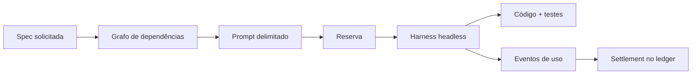

# SDD Delivery Engine

O engine é o control plane reutilizável deste repositório. Ele integra DeepSeek Harness, rotas OpenAI, composição de prompts, validação SDD, ingestão de fontes, budgets, histórico portátil e contabilidade de custo.

## Arquitetura

```text
engine/
  config/                       rotas, budgets e price books
  scripts/                      criação, materialização, validação e execução
  .dsh/skills/sdd-delivery/     instruções usadas pelo agente
  docs/sdd/                     specs da infraestrutura
  cost/ledger.jsonl             ledger append-only entre projetos
  test/                         testes offline do control plane

specs/<project-id>/             fonte versionada do contrato do produto
  project.json                  identidade e paths consumidos pelo engine
  AGENTS.md                     regras locais do projeto
  config/sources.json           fontes públicas e hashes
  docs/sdd/                     specs, manifesto e rastreabilidade

projects/<project-id>/          área executável materializada
  package.json                  comandos de build e teste
  src/                          aplicação
  test/                         evidência executável
  .sdd/                         prompts, inputs, sessões e resultados locais
```

O diretório `specs/` preserva a definição revisável de cada produto. O diretório `projects/` recebe uma cópia materializada e funciona como `cwd` e raiz de sandbox do Harness. O engine valida IDs em lower-kebab-case, mantém os paths do descriptor dentro do projeto selecionado e associa cada run ao projeto, change ID e conjunto de specs.

## Materialização de um projeto versionado

Execute na raiz do repositório:

```bash
npm ci
npm run dsh:config

npm run project:create -- \
  --id catalog-consolidation \
  --title "VTEX Catalog Consolidation"
cp -R specs/catalog-consolidation/. projects/catalog-consolidation/
npm run project:validate -- \
  --project catalog-consolidation --working-tree
```

O mesmo fluxo atende qualquer diretório `specs/<project-id>`:

```bash
npm run project:create -- \
  --id <project-id> \
  --title "<Project title>"
cp -R "specs/<project-id>/." "projects/<project-id>/"
npm run project:validate -- \
  --project <project-id> --working-tree
```

`project:create` entrega o scaffold comum. A cópia seguinte instala o contrato versionado do projeto sobre esse scaffold.

## Comandos do engine

```bash
npm run project:validate -- --project <project-id> --working-tree
npm run project:sources -- --project <project-id>
npm run project:prepare -- --project <project-id> --change <change-id> --spec <SDD-ID>
npm run project:run -- --project <project-id> --change <change-id> --spec <SDD-ID>
npm run project:cost -- --project <project-id>
npm run project:history:create -- --project <project-id> --snapshot <snapshot-id> --cutoff <UTC>
npm run project:history:validate -- --project <project-id> --snapshot <snapshot-id>
```

### Preparação e execução

`project:prepare` executa validação, fecha dependências, marca specs solicitadas como `IMPLEMENT`, inclui dependências como `CONTEXT ONLY`, projeta budget e grava os artefatos locais em `.sdd/`.

`project:run` repete a preparação, reserva budget, inicia o Harness dentro da área materializada, observa uso do provider, produz o resultado do run e acrescenta o settlement ao ledger.



### Recuperação de capacidade

Runs na rota default podem reservar a tentativa final para Luna durante uma resposta `429` reconhecida:

```bash
npm run project:run -- \
  --project <project-id> \
  --change <change-id> \
  --spec <SDD-ID> \
  --route default \
  --rate-limit-fallback economy
```

A política preserva o escopo do run, o estado do projeto e a contabilização por tentativa. Terra permanece como rota default; Luna atende o fallback economy; Sol participa somente da rota escalation aprovada.

## Verificação do engine

```bash
npm run dsh:config
npm run sdd:validate
npm test
npm run check
git diff --check
```

Esses gates validam configuração do Harness, projetos materializados, grafos SDD, fontes, secrets, price books, ledger e os testes do engine. Execuções de engenharia com modelo recebem `OPENAI_API_KEY` pelo ambiente do processo; validação, preparação, relatórios e CI permanecem determinísticos.
