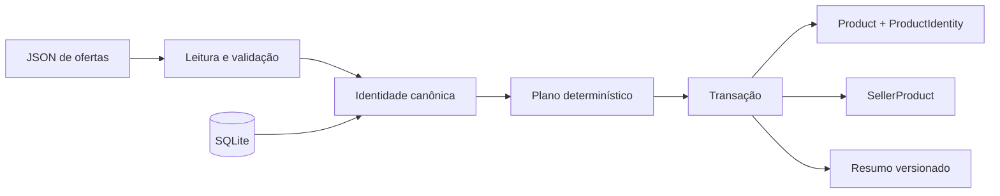

# VTEX Catalog Consolidation

Aplicação TypeScript de linha de comando que consolida ofertas de sellers em um catálogo SQLite. A implementação usa identidade de produto determinística, transação atômica, SQL parametrizado e resumos JSON versionados.

A fonte canônica das especificações fica em [`../../specs/catalog-consolidation`](../../specs/catalog-consolidation). Este diretório é a área materializada usada pelo engine SDD para código, testes e evidências.

## Arquitetura



`Id` e `SellerName` têm escopo por seller. A identidade versionada compara a tupla canônica `(Name, Brand, Category)`, com normalização explícita de caixa, acentos, pontuação, espaços e aliases revisados. Correspondências reutilizam o produto canônico; produtos distintos recebem identidade própria; ambiguidades retornam diagnóstico estável e rollback integral.

## Instalação e gates

```bash
npm ci
npm run check
npm run demo:feature
```

`check` compila TypeScript, executa a suíte pública e valida manifesto e rastreabilidade. `demo:feature` cria um catálogo e um input sintéticos em diretório temporário e comprova:

- dry run com bytes preservados;
- um novo produto e três vínculos na primeira aplicação;
- dois sellers reutilizando um produto existente;
- replay idempotente com zero novas inserções.

## CLI

```bash
npm run build

node dist/cli.js \
  --input <products.json> \
  --database <catalog.db> \
  [--dry-run] \
  [--format text|json] \
  [--verbose-local] \
  [--debug]
```

O input aceita `Id` e `SellerName` com até 512 unidades UTF-16 e `Name`, `Brand` e `Category` com até 2.048. `Brand` aceita `null`. O arquivo de entrada atual opera com limite de 5 MiB, diagnósticos bounded e `busy_timeout` SQLite de 5 segundos. A evolução configurável desses valores está especificada em `SDD-010`.

Cada execução produz uma síntese com run ID, duração, versões de normalização/schema e contagens planejadas ou aplicadas. Os códigos estáveis incluem validação de input, conflito por seller, ambiguidade de identidade, conflito de vínculo, schema, migração, lock e integridade.

## Fontes pinadas e fixture

```bash
npm run sources:ingest
npm run test:fixture
```

As fontes são baixadas para `.sdd/inputs/` e verificadas pelos SHA-256 registrados em `config/sources.json`. O teste de fixture usa uma cópia descartável do catálogo e comprova aplicação seguida de replay idempotente.

## Casos focados

```bash
node --test test/hc-01-cross-seller-match.test.ts
node --test test/hc-02-seller-scoped-id.test.ts
node --test test/hc-03-normalized-variants.test.ts
node --test test/hc-04-potential-duplicate.test.ts
node --test test/hc-05-distinct-model.test.ts
node --test test/hc-06-ambiguous-rollback.test.ts
node --test test/hc-07-rerun-order.test.ts
node --test test/hc-08-hostile-text.test.ts
```

Esses testes cobrem convergência entre sellers, escopo de IDs opacos, normalização, colisões, modelos distintos, rollback, ordem de entrada e tratamento literal de strings hostis.

## Comandos SDD

Execute da raiz do repositório:

```bash
npm run project:validate -- \
  --project catalog-consolidation --working-tree

npm run project:prepare -- \
  --project catalog-consolidation \
  --change <change-id> \
  --spec <SDD-ID> \
  --route default

npm run project:run -- \
  --project catalog-consolidation \
  --change <change-id> \
  --spec <SDD-ID> \
  --route default

npm run project:cost -- --project catalog-consolidation
```

As specs, o manifesto e a rastreabilidade recíproca estão em [`docs/sdd/`](docs/sdd/). A evidência por critério fica em [`docs/sdd/evidence-index.md`](docs/sdd/evidence-index.md).
