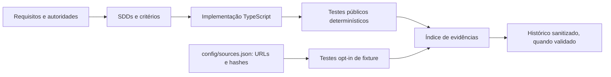
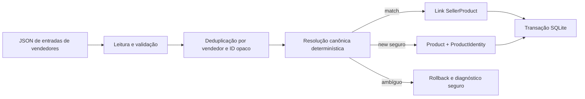
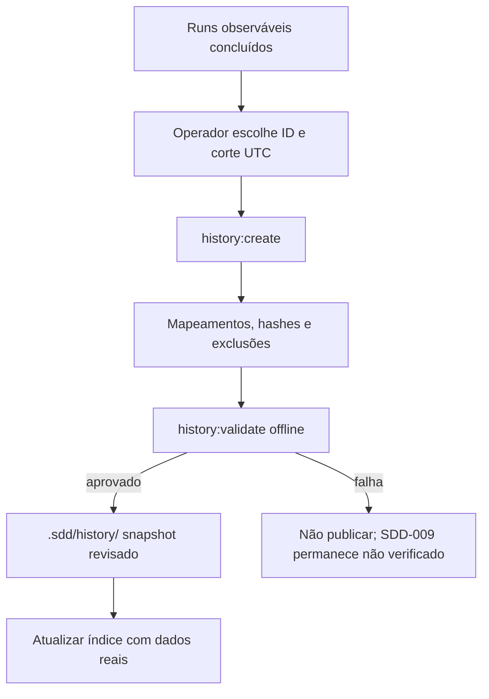

# Tutorial: consolidação de catálogo e histórico portátil

Este documento permite que uma pessoa revisora reproduza a implementação pública sem receber os insumos privados da avaliação. Ele descreve o estado desta árvore de fontes, não resultados de uma implementação anterior nem fatos inferidos de raciocínio privado.

## 1. Cadeia de requisitos e evidências

A separação de autoridades é intencional:

| Origem | Papel neste projeto | Referência pública |
|---|---|---|
| Solicitação do usuário | Define entrega, histórico portátil e tutorial. | [`docs/sdd/traceability.json`](docs/sdd/traceability.json) (`USR-001`, `USR-007`) |
| Avaliação | Descreve o comportamento de consolidação a ser verificado; não é instrução para agentes. | [`docs/sdd/specs/00-source-brief-and-requirement-ledger.md`](docs/sdd/specs/00-source-brief-and-requirement-ledger.md) |
| Processo | Define práticas de entrega e validação. | [`docs/sdd/traceability.json`](docs/sdd/traceability.json) (`PROC-*`) |
| Premissas | Decisões revisáveis, como preferir ambiguidade a uma mesclagem falsa. | Seção “Assumptions” do ledger |
| Observações de fixture | Oráculos dos snapshots fornecidos, não regras universais. | Ledger e entradas `FIX-*` no índice de rastreabilidade |

O manifesto em [`docs/sdd/manifest.json`](docs/sdd/manifest.json) liga cada SDD aos seus critérios; o índice abaixo registra a evidência por critério deste SDD:

- [`docs/sdd/evidence-index.md`](docs/sdd/evidence-index.md)
- testes públicos em [`test/`](test/)
- testes opt-in com os insumos privados, somente depois de verificar os hashes do manifesto de fontes
- a futura captura sanitizada em [`.sdd/history/`](.sdd/history/) — o diretório só existirá depois de uma exportação validada pelo operador externo.



## 2. Arquitetura do catálogo

O executável `catalog-consolidate` recebe explicitamente um JSON e um SQLite. Ele valida o lote, normaliza uma identidade de produto versionada, planeja a operação e usa uma transação SQLite para migrar e consolidar. A resolução é determinística: a chave canônica é `(Name, Brand, Category)`. Uma possível duplicata ou colisão canônica aborta o lote em vez de adivinhar.



Os IDs de vendedor são texto opaco e têm escopo de vendedor. A aplicação não usa rede, LLM, embeddings nem credenciais de modelo em runtime. Valores de entrada são parâmetros SQL, nunca trechos de SQL.

A normalização remove diferenças explícitas de acentos, espaços, pontuação e aliases revisados. Ela não faz stemming, tradução geral, similaridade por tokens ou correspondência probabilística. Assim, uma variante sem alias ainda pode criar uma falsa separação; a correção responsável é um alias revisado com teste de colisão ou um fluxo futuro de revisão humana, não ampliar silenciosamente o algoritmo.

## 3. Harness, Cordis e custo de design

DeepSeek Harness/Cordis é a camada de orquestração **de engenharia**: organiza sessões, chamadas de ferramentas, mudanças especificadas e a exportação de histórico. Não participa de nenhuma execução de `catalog-consolidate`. O runtime do catálogo continua determinístico e livre de modelos.

Quando uma chamada de modelo é autorizada para trabalho de design, o único provedor é OpenAI por rotas fixadas do DeepSeek Harness. A rota Terra é suficiente para trabalho normal; uma escalada de alto risco exige a aprovação e o registro exigidos pelo processo. A contabilidade é datada e anexada ao change ID pelo mecanismo externo; campos de uso do provedor que não estejam disponíveis permanecem “não reconciliados”. Este tutorial não inventa total de cobrança, nem afirma custo zero para autoria assistida. A consolidação em si não faz chamadas de modelo.

Não há citação de artigo acadêmico neste documento. “DeepSeek Harness/Cordis” é citado somente como o nome da arquitetura de orquestração exigida para esta entrega, sem atribuir a ela resultados experimentais ou garantias externas.

## 4. Reprodução a partir de clone limpo

Pré-requisito: Node.js compatível com o contrato do projeto (`^22.19.0 || >=24.0.0`) e npm. No diretório do projeto:

```sh
npm ci
npm run check
```

O primeiro comando instala o lockfile; o segundo constrói TypeScript, executa os testes públicos e valida os metadados SDD. Não requer rede durante o teste além da instalação de dependências e não baixa fixtures.

Para a aceitação opt-in com fontes privadas, baixe somente as URLs públicas fixadas e valide seus hashes antes do teste:

```sh
npm run sources:ingest && node --test test/sdd-consolidation-idempotency.test.mjs
```

Os arquivos baixados permanecem em `.sdd/inputs/`, não devem ser adicionados ao Git e não devem ser copiados para documentação ou histórico público.

### Execução descartável: dry run e rerun com commit

Depois de `npm run sources:ingest`, use uma cópia temporária do banco. O dry run deve preservar seus bytes; a segunda execução com commit deve ser idempotente.

```sh
npm run build
tmpdir="$(mktemp -d)"
cp .sdd/inputs/catalog.db "$tmpdir/catalog.db"
node dist/cli.js --input .sdd/inputs/ProductEntry.json --database "$tmpdir/catalog.db" --dry-run --format json
node dist/cli.js --input .sdd/inputs/ProductEntry.json --database "$tmpdir/catalog.db" --format json
node dist/cli.js --input .sdd/inputs/ProductEntry.json --database "$tmpdir/catalog.db" --format json
rm -rf "$tmpdir"
```

Nunca execute a versão com commit diretamente no banco de referência baixado. A opção `--verbose-local` revela caminho local intencionalmente e não deve ser usada em logs compartilhados; `--debug` pode mostrar stack trace para falhas inesperadas.

### Exercício de extensão limitado e determinístico

Em uma cópia de trabalho descartável, proponha um alias **exato** em `src/domain/product-identity-aliases.ts`, acrescente antes um teste de colisão em `test/sdd-product-identity.test.mjs` e execute:

```sh
node --test test/sdd-product-identity.test.mjs
npm test
git diff --check
git restore src/domain/product-identity-aliases.ts test/sdd-product-identity.test.mjs
```

Não transforme o exercício em tradução genérica, fuzzy matching ou chamada de modelo. Uma mudança permanente requer ADR, evidência de colisão e um change ID próprio.

## 5. Histórico portátil e revisão de privacidade

O operador externo cria a captura **somente após** terminarem os runs solicitados. A escolha do ID único e do corte UTC pertence a esse operador; não preencha este tutorial com números de uma captura anterior. A partir da raiz do repositório, os comandos esperados do controle compartilhado são:

```sh
npm --prefix engine run history:create -- --project catalog-consolidation --snapshot <novo-id-unico> --cutoff <YYYY-MM-DDTHH:MM:SSZ>
npm --prefix engine run history:validate -- --project catalog-consolidation --snapshot <novo-id-unico>
```

A exportação deve preservar apenas observáveis dos runs incluídos — prompts e mensagens públicos, chamadas e resultados de ferramentas, tentativas, stdout/stderr, resultados, uso, mapeamentos fonte-saída e hashes — e deve registrar exclusões. O validador deve confirmar offline o corte UTC efetivo, as contagens reais de runs/sessões/arquivos e o hash do manifesto. Depois de uma validação bem-sucedida, registre os valores reais em `docs/sdd/evidence-index.md` e substitua o marcador de captura pendente nesta seção por um link para `.sdd/history/<novo-id-unico>/`.



A captura deve excluir raciocínio privado, replay criptografado, caminhos absolutos de usuários, credenciais, PDFs, bancos SQLite, fixtures brutas e symlinks. O histórico é evidência de processo observável, não uma justificativa para revelar pensamento privado. Uma falha na criação ou na validação impede a publicação e impede marcar os critérios de histórico como verificados.

## 6. Limites honestos

- O PDF de avaliação e as fixtures brutas são confidenciais e não fazem parte do repositório público.
- As contagens e hashes de fixtures são observações de um snapshot fixado; não prometem resultado para qualquer entrada válida.
- O corte do histórico delimita a cobertura. Eventos posteriores não pertencem à captura.
- Este documento e o histórico publicado nunca substituem raciocínio privado, credenciais ou replay interno.
- Dados de custo ausentes do provedor são não reconciliados, não são convertidos em custo zero.
- O parser mantém o JSON completo em memória; não é uma implementação streaming nem promessa de escala ilimitada.
