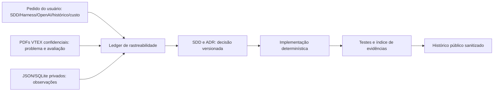
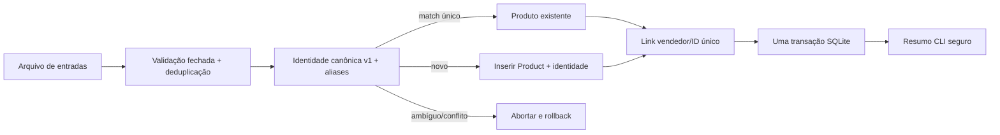
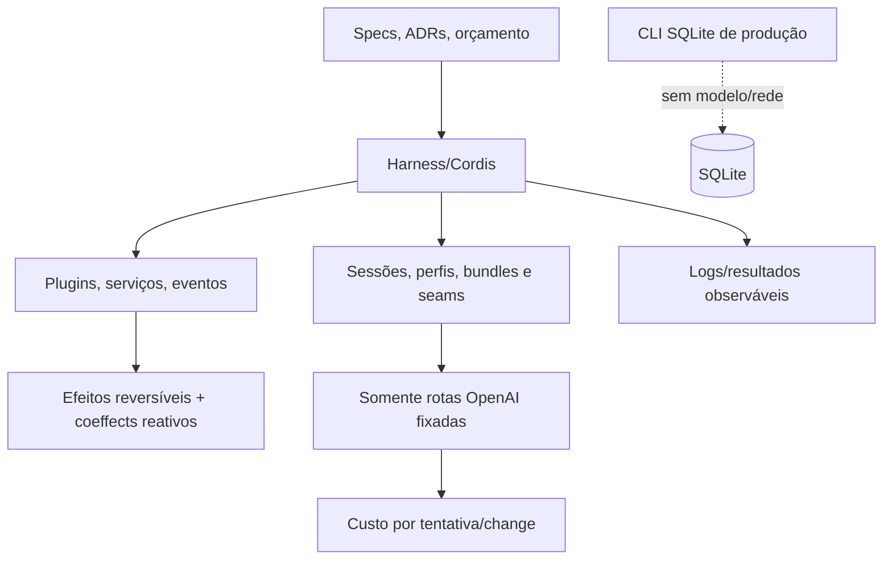
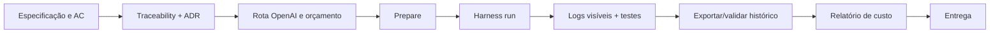

# Tutorial: defesa portátil e reprodutível da consolidação de catálogo

Este documento atende tanto ao avaliador VTEX quanto a quem mantiver o projeto. Ele descreve evidência pública e decisões verificáveis; não reproduz fontes confidenciais, entradas privadas ou raciocínio privado. O CLI de produção é TypeScript determinístico, local e **model-free**: não chama OpenAI, DeepSeek nem outro modelo.

## 1. Autoridade, observação e rastreabilidade

Há três limites que não podem ser confundidos. Os dois PDFs confidenciais da VTEX descrevem o problema e as restrições de avaliação; eles não são lidos, copiados, incorporados ou citados literalmente neste repositório. Os pedidos do usuário autorizam a entrega SDD, Harness, OpenAI, histórico e custos. Fixtures JSON/SQLite são observações da amostra, não regras universais de negócio. O ledger público parafraseia cada requisito e classifica ainda orientação de processo e suposições de engenharia.

| Pergunta | Fonte pública de defesa |
|---|---|
| Quem autorizou e qual tipo de afirmação é esta? | [`traceability.json`](docs/sdd/traceability.json) |
| Qual decisão e critério a implementa? | [especificações SDD](docs/sdd/specs/) e [ADRs](docs/adr/) |
| Onde está o código e o teste? | [`src/`](src/), [`test/`](test/) e [índice de evidências](docs/sdd/evidence-index.md) |
| Que execução de engenharia é publicável? | [snapshot portátil](.sdd/README.md) e seu manifesto/hash |



A cadeia é **requisito → decisão → especificação → implementação → teste/evidência**. Ela torna contestável uma decisão sem transformar uma observação ou um PDF confidencial em dado público.

### Mapa de decisão e prova

| Requisito observado/autorizado | Decisão | Especificação/ADR | Implementação | Teste/evidência |
|---|---|---|---|---|
| Receber entradas e preservar IDs opacos | contrato fechado e escopo por vendedor | SDD-001/002; ADR-0001 | `src/domain/input.ts`, `src/domain/types.ts` | `node --test test/input.test.ts test/cli.test.ts` |
| Resolver identidade sem fusão silenciosa | fingerprint canônico v1 e aliases revisados | SDD-004; ADR-0002 | `src/domain/product-identity.ts` | `node --test test/product-identity.test.ts` |
| Persistir com segurança e repetir sem efeitos | migração versionada, unicidade e uma transação | SDD-003/005; ADR-0002 | `src/adapters/sqlite-catalog.ts`, `src/application/consolidate.ts` | `node --test test/migration.test.ts test/consolidation.test.ts` |
| Entregar CLI observável e seguro | envelopes versionados, limites e erros estáveis | SDD-006/007; ADR-0003 | `src/cli.ts`, `src/adapters/reporter.ts` | `node --test test/cli.test.ts`; `npm run check` |
| Publicar histórico portátil e recuperação do control plane | exportação sanitizada; retries 429 limitados | SDD-009; engine SDD-094/095 | `engine/scripts/history.mjs`, `engine/scripts/lib/rate-limit.mjs` | comandos de validação abaixo; `engine/test/rate-limit.test.mjs` |

Fixtures JSON/SQLite confirmam a amostra, mas não elevam observações a requisitos nem substituem esses testes.

## 2. O consolidator: regras fechadas e explicáveis

A entrada passa por validação fechada: objetos e campos permitidos, limites de tamanho/linhas, diagnósticos limitados e deduplicação estável. IDs de produto do vendedor são texto opaco e só têm significado no vendedor. A identidade para comparação é canônica, explicável e versionada: `(Name, Brand, Category)` normalizado, com aliases pequenos, revisados e versionados. Não há distância fuzzy, embeddings ou LLM em runtime.

A migração SQLite preserva campos de apresentação e acrescenta a identidade de comparação. As restrições de unicidade (inclusive a relação vendedor/ID opaco) são a última autoridade de idempotência. Uma única transação `BEGIN IMMEDIATE` cobre migração, resolução, inserção e links; qualquer ambiguidade, conflito ou erro desfaz o lote. Colisão canônica não escolhe arbitrariamente: devolve candidatos estáveis e aborta. SQL é parametrizado, caminhos são fornecidos explicitamente, entrada e saída são limitadas e o resumo do CLI não expõe linhas, SQL, segredos ou telemetria.



Nos fixtures observados, a primeira execução teve **269 entradas**, **268 relações distintas**, **267 matches**, **um produto novo** e **976 produtos finais**. A repetição foi um no-op lógico (zero produtos e links inseridos). São oráculos da amostra, não prova de identidade global, escala ou cobertura universal.

Alternativas deliberadamente rejeitadas: matching fuzzy/LLM em produção (não explicável e pode fundir errado), um prompt gigante (frágil e pouco auditável), banco sem restrições (não garante idempotência) e arquitetura distribuída desnecessária (não é justificada para o escopo SQLite local).

## 3. Control plane SDD e runtime de produção

O control plane SDD organiza especificação, orçamento, execução, logs e validação. O runtime de produção consolida catálogo sem agente e sem chamada de modelo. Essa separação permite usar automação de engenharia sem introduzir latência, credenciais, rede ou não determinismo no CLI.

O **DeepSeek Harness** é o host de automação: plugins adicionam capacidades; serviços oferecem recursos compartilhados; eventos tornam estados observáveis; efeitos reversíveis registram ações que podem ser desfeitas; coeffects reativos fornecem contexto/estado às reações. Perfis e bundles selecionam configurações e capacidades; sessões persistem tentativa, mensagens, ferramentas e resultado; seams são fronteiras substituíveis para modelo, relógio, armazenamento, sandbox e ferramentas. Isso dá composabilidade espacial (substituir componentes em um mesmo fluxo) e temporal (retomar/inspecionar sessões e efeitos ordenados). A relação é contextual com [arXiv:2608.25512](https://arxiv.org/abs/2608.25512), não uma alegação de que o artigo prova este projeto; veja também a [arquitetura oficial do Harness](https://github.com/deepseek-ai/deepseek-harness/blob/main/docs/architecture.md).



Em vez de um script monolítico de agente, Harness é preferível aqui porque componentes podem ser trocados sem redesenhar o fluxo, sessões são duráveis/auditáveis, cada projeto é isolado, efeitos podem ser revertidos, execuções são reproduzíveis e o modelo é portátil por seam. A ressalva é importante: Harness está em developer preview e a versão/configuração é fixada; atualizações exigem revisão e nova validação, não confiança em compatibilidade implícita.

## 4. Modelos, custos e recuperação de rate limit

A estratégia é estritamente OpenAI via rotas do Harness: **Luna** para trabalho mecânico/de alto volume, **Terra** como padrão e **Sol** somente após escalonamento explicitamente aprovado. Não há modelos DeepSeek como provedor de modelo e Sol jamais é fallback. Consulte as páginas primárias oficiais de [GPT-5.6-Luna](https://developers.openai.com/api/docs/models/gpt-5.6-luna), [GPT-5.6-Terra](https://developers.openai.com/api/docs/models/gpt-5.6-terra) e [GPT-5.6-Sol](https://developers.openai.com/api/docs/models/gpt-5.6-sol); preços e capacidades podem mudar, portanto o relatório usa o price book versionado e datado do repositório para os cálculos históricos de custo e não afirma valores imutáveis.

O ledger separa buckets sem sobreposição de **input**, **cache-read**, **cache-write** e **output**, em nanodólares inteiros; tokens de reasoning já pertencem a `output` e não formam um quinto bucket. O relatório agrega por `changeId`, aplica o tier acima de 272 mil tokens quando elegível e registra reservas antes da chamada, settlements/retries por tentativa e uso ainda não resolvido. Campos que o provedor não entrega permanecem `unreconciled`; o tier de serviço `standard-assumed` é uma limitação explícita, não reconciliação de fatura.

Para SDD-095, só falha conhecida `429`/`RATE_LIMIT` é retentável: no máximo três tentativas totais, backoff exponencial limitado com jitter, e `Retry-After` conhecido tem precedência dentro do teto. A linha observada `dsh: RATE_LIMIT:` só é aceita com atraso válido; prosa arbitrária contendo “rate limit” permanece terminal. Um único lock e o mesmo escopo são mantidos entre tentativas; cada uma tem sessão/log e custo próprios, e o uso é isolado por identidade durável mesmo quando um evento é anexado ao mesmo arquivo. Exaustão retorna **75**; cancelamento retorna **130**, encerra o filho com SIGTERM e só usa SIGKILL após a graça configurada, preservando settlement e árvore parcial. O fallback economy é opt-in, aguarda o mesmo atraso e sinaliza a transição, apenas Terra/default → Luna, preserva orçamento/escopo e nunca roteia para Sol.

## 5. Fluxo de uma feature nova



1. Escreva spec e critérios de aceitação; conecte o requisito no ledger e registre ADR quando houver trade-off.
2. Escolha rota e orçamento (Terra padrão; Luna mecânico; Sol somente aprovação); execute `sdd:prepare`.
3. Execute o Harness com change/spec explícitos. Acompanhe stdout/stderr e `result.json`; em 429 reconhecido, a recuperação limitada preserva árvore, lock e escopo.
4. Rode testes visíveis, depois o gate do projeto e da raiz. Para uma feature de runtime, não introduza modelo.
5. Exporte/valide somente o histórico público autorizado, valide custo e entregue a evidência. Não publique estado operacional bruto.

Exercício seguro: numa mudança futura sob **SDD-004** (ou nova SDD dependente), acrescente em `test/product-identity.test.ts` um literal público que prova normalização determinística. Não use fixture privada, fuzzy matching nem banco real. Verifique com `node --test test/product-identity.test.ts` e `npm run check`.

## 6. Comandos de reprodução e inspeção

A partir da raiz do repositório, instale as duas árvores de dependências antes de executar as verificações:

```bash
npm ci
npm --prefix projects/catalog-consolidation ci
npm run check                         # infraestrutura engine/SDD
npm --prefix projects/catalog-consolidation run check  # gate separado do projeto
```

A sequência explícita completa abaixo começa na raiz do repositório; depois de entrar em `projects/catalog-consolidation`, `npm ci` continua sendo suficiente para o gate local. O comando preferido, mantido pelo repositório, é `npm run sources:ingest`: ele baixa as mesmas URLs fixadas e valida automaticamente tamanho e hash. O fluxo explícito abaixo também é reproduzível quando se quer ver cada URL e verificação; execute-o somente depois de `npm ci`:

```bash
cd projects/catalog-consolidation
npm ci
mkdir -p .sdd/inputs

curl --fail --silent --show-error --location --proto '=https' --tlsv1.2 \
  'https://engineering-hiring-process.s3.us-east-1.amazonaws.com/ProductEntry.json' \
  --output .sdd/inputs/ProductEntry.json
curl --fail --silent --show-error --location --proto '=https' --tlsv1.2 \
  'https://engineering-hiring-process.s3.us-east-1.amazonaws.com/catalog.db' \
  --output .sdd/inputs/catalog.db

shasum -a 256 -c - <<'EOF'
1b0c861fe568c19e8b1cebcf774ee3d1d95baf8c42e35129e4ae806ece04b8f6  .sdd/inputs/ProductEntry.json
733ff1d9cc20253da48a9f8b33d7241503e4a06e7c68f65f7fa00ef14466c404  .sdd/inputs/catalog.db
EOF

# .sdd/inputs é ignorado e privado; nunca escreva no banco baixado.
cp .sdd/inputs/catalog.db /tmp/catalog-disposable.db
node src/cli.ts --input .sdd/inputs/ProductEntry.json --database /tmp/catalog-disposable.db --dry-run --format json
node src/cli.ts --input .sdd/inputs/ProductEntry.json --database /tmp/catalog-disposable.db --format json
# Segunda execução idêntica: deve reportar zero produtos e zero links inseridos.
node src/cli.ts --input .sdd/inputs/ProductEntry.json --database /tmp/catalog-disposable.db --format json
```

`/tmp/catalog-disposable.db` é uma cópia descartável; o arquivo original em `.sdd/inputs/catalog.db` não recebe operações de escrita do CLI. O `--format json` permanece para permitir inspeção estável e legível por máquina.

Os testes públicos e demais comandos de SDD, custo e histórico permanecem:

```bash
npm run check                         # suite pública: 30 testes
npm run sources:ingest && npm run test:fixture  # 4 testes, somente se fixtures configurados
npm run sdd:prepare -- --change minha-feature --spec SDD-004
npm run sdd:run -- --change minha-feature --spec SDD-004
# inspeção de transcript/resultados de uma execução operacional local (se existir)
ls .sdd/runs/<run-id>/prompt.md .sdd/runs/<run-id>/stdout.txt .sdd/runs/<run-id>/stderr.txt .sdd/runs/<run-id>/result.json
npm run cost:report                 # relatório agregado por changeId
npm --prefix ../../engine run cost:report -- --project catalog-consolidation
npm run sdd:history:validate -- --snapshot catalog-consolidation-pre-portable-history-2026-09-06
```

Criação de histórico é uma operação controlada: não recrie o snapshot histórico abaixo. Para um snapshot futuro autorizado, use `npm run sdd:history:create -- --snapshot <novo-id> --cutoff <ISO-8601>`; valide com `npm run sdd:history:validate -- --snapshot <novo-id>`. Inspecione o público com `git show HEAD:projects/catalog-consolidation/.sdd/README.md` e os manifestos/relatórios do snapshot; logs operacionais ficam fora dele. Da raiz, o gate completo é `npm run check`.

## 7. Snapshot público e limitações

O snapshot público imutável é [`catalog-consolidation-pre-portable-history-2026-09-06`](.sdd/history/catalog-consolidation-pre-portable-history-2026-09-06), com cutoff **`2026-09-06T17:58:48.000Z`**, cobertura de **25 runs**, **17 sessões** e **86 arquivos publicados**. O SHA-256 do manifesto informado na criação é `d1a417f58a0e955bdd1904654c2f0580a6eef24b7ae58b70fe493b2ab836f390`. [`.sdd/README.md`](.sdd/README.md) explica inspeção, exclusões e validação.

O histórico é offline e termina no cutoff. Ele preserva eventos observáveis sanitizados (mensagens, chamadas/resultados de ferramentas, retries, stdout/stderr, resultados e uso) com mapeamentos/hashes, mas não raciocínio privado, replay criptografado, PDFs, fixtures brutas, bancos, credenciais, symlinks ou caminhos absolutos. Ausência de um evento privado não prova que ele nunca existiu. Da mesma forma, fixtures e identidade canônica têm o limite já declarado: preferem falso split a fusão silenciosa. Custos são medidos/estimados com limitações de tier e uso, não faturas reconciliadas.
