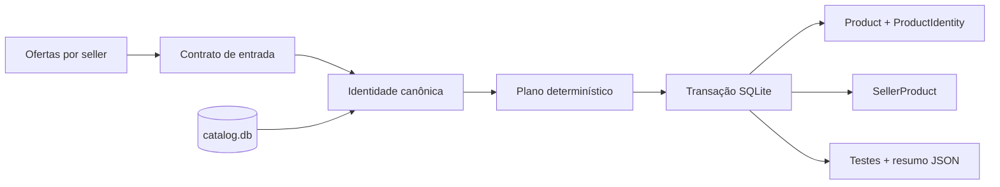

# Specs — VTEX Catalog Consolidation

Este diretório é a fonte versionada do projeto `catalog-consolidation`. Ele contém 12 especificações (`SDD-000` a `SDD-011`), o manifesto, a rastreabilidade recíproca, o contrato do agente e as fontes pinadas do exercício.

## Arquitetura especificada



A arquitetura prioriza identidade explicável, sellers isolados por escopo, idempotência e atomicidade. `SDD-010` define limites operacionais configuráveis e `SDD-011` define uma demonstração pública autocontida da funcionalidade.

## Materializar no engine

Execute da raiz do repositório em um clone limpo:

```bash
npm ci
npm run dsh:config

npm run project:create -- \
  --id catalog-consolidation \
  --title "VTEX Catalog Consolidation"

cp -R specs/catalog-consolidation/. projects/catalog-consolidation/

npm run project:validate -- \
  --project catalog-consolidation --working-tree
```

O scaffold fornece os arquivos operacionais comuns; este diretório fornece o contrato de produto revisado.

## Ordem das fatias

| Change ID | Specs | Resultado |
|---|---|---|
| `catalog-one-foundation` | `SDD-000,SDD-001` | Autoridade, fronteira e CLI |
| `catalog-one-input` | `SDD-002` | Leitura e validação |
| `catalog-one-schema` | `SDD-003` | Schema e migrations |
| `catalog-one-identity` | `SDD-004` | Identidade determinística |
| `catalog-one-consolidation` | `SDD-005` | Transação e idempotência |
| `catalog-one-safety` | `SDD-006` | Segurança e observabilidade |
| `catalog-one-verification` | `SDD-007` | Estratégia completa de testes |
| `catalog-one-operational-limits` | `SDD-010` | Limites configuráveis |
| `catalog-one-feature-existence-demo` | `SDD-011` | Demonstração executável |
| `catalog-one-release` | `SDD-008` | Entrega e defesa técnica |
| `catalog-one-history` | `SDD-009` | Histórico portátil e tutorial |

Para cada linha:

```bash
npm run project:prepare -- \
  --project catalog-consolidation \
  --change <change-id> \
  --spec <SDD-ID[,SDD-ID]> \
  --route default

npm run project:run -- \
  --project catalog-consolidation \
  --change <change-id> \
  --spec <SDD-ID[,SDD-ID]> \
  --route default

npm run project:validate -- \
  --project catalog-consolidation --working-tree
```

## Mapa do contrato

- [`project.json`](project.json): identidade e paths do projeto.
- [`AGENTS.md`](AGENTS.md): fronteiras e práticas de entrega.
- [`config/sources.json`](config/sources.json): URLs, bytes e hashes das fontes.
- [`docs/sdd/manifest.json`](docs/sdd/manifest.json): grafo, status e acceptance criteria.
- [`docs/sdd/traceability.json`](docs/sdd/traceability.json): autoridade e ownership recíproco.
- [`docs/sdd/specs/`](docs/sdd/specs/): comportamento detalhado por fatia.

O guia integrado, a defesa arquitetural e os comandos dos dois projetos estão no [`README.md` raiz](../../README.md).
