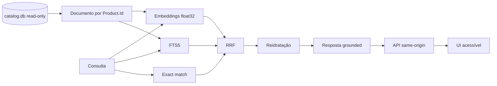

# Specs — VTEX Catalog RAG, API e UI

Este diretório é a fonte versionada do projeto `catalog-rag`. Ele contém 10 especificações (`SDD-000` a `SDD-009`) para transformar o catálogo consolidado em uma experiência de busca híbrida, resposta grounded, citações e interface web.

## Arquitetura especificada



O `catalog.db` atua como fonte de verdade em modo leitura. O sidecar `catalog-rag.db` concentra documentos derivados, FTS, vetores e estado do índice. A projeção ordenada por `Product.Id` e o hash de conteúdo suportam atualização incremental. Adapters injetáveis atendem testes offline e providers configurados em runtime.

## Materializar os projetos

O RAG consome o banco produzido pelo consolidator. Em um clone limpo, materialize os dois contratos:

```bash
npm ci
npm run dsh:config

npm run project:create -- \
  --id catalog-consolidation \
  --title "VTEX Catalog Consolidation"
cp -R specs/catalog-consolidation/. projects/catalog-consolidation/
npm run project:validate -- \
  --project catalog-consolidation --working-tree

npm run project:create -- \
  --id catalog-rag \
  --title "VTEX Catalog RAG Search UI"
cp -R specs/catalog-rag/. projects/catalog-rag/
npm run project:validate -- \
  --project catalog-rag --working-tree

npm run check
```

A política de adapters do runtime está descrita em [`docs/sdd/engine-policy-prerequisite.md`](docs/sdd/engine-policy-prerequisite.md). Ela orienta a revisão do engine antes das fatias que habilitam embedding e resposta por provider.

## Ordem das fatias

| Change ID | Specs | Resultado |
|---|---|---|
| `catalog-rag-foundation` | `SDD-000,SDD-001` | Autoridade, projeção e sidecar |
| `catalog-rag-index` | `SDD-002` | Providers e índice incremental |
| `catalog-rag-retrieval` | `SDD-003` | Retrieval híbrido e reidratação |
| `catalog-rag-answer-api` | `SDD-004,SDD-005` | Grounding, citações e HTTP |
| `catalog-rag-search-ui` | `SDD-006` | Interface acessível |
| `catalog-rag-runtime-operations` | `SDD-007` | Segurança, observabilidade e custo runtime |
| `catalog-rag-causal-grounding-audit` | `SDD-009` | Fact-check e auditoria causal |
| `catalog-rag-release` | `SDD-008` | Evals, E2E e entrega |

Para cada fatia:

```bash
npm run project:prepare -- \
  --project catalog-rag \
  --change <change-id> \
  --spec <SDD-ID[,SDD-ID]> \
  --route default

npm run project:run -- \
  --project catalog-rag \
  --change <change-id> \
  --spec <SDD-ID[,SDD-ID]> \
  --route default

npm run project:validate -- \
  --project catalog-rag --working-tree
```

Uma execução que recebe `429` pode reservar a tentativa final para a rota economy mantendo projeto, change ID e specs:

```bash
npm run project:run -- \
  --project catalog-rag \
  --change <change-id> \
  --spec <SDD-ID[,SDD-ID]> \
  --route default \
  --rate-limit-fallback economy
```

## Gates por fatia

```bash
npm run project:validate -- \
  --project catalog-rag --working-tree
npm --prefix projects/catalog-rag run check
npm run check
npm run project:cost -- --project catalog-rag
git diff --check
```

Após a fundação gerar o lockfile e os scripts da aplicação:

```bash
npm --prefix projects/catalog-rag ci
```

## Produzir o catálogo consumido pelo RAG

```bash
npm run project:sources -- --project catalog-consolidation
npm --prefix projects/catalog-consolidation run build

mkdir -p projects/catalog-rag/.sdd/inputs
mkdir -p projects/catalog-rag/.sdd/runtime

cp projects/catalog-consolidation/.sdd/inputs/catalog.db \
  projects/catalog-rag/.sdd/inputs/catalog.db

node projects/catalog-consolidation/dist/cli.js \
  --input projects/catalog-consolidation/.sdd/inputs/ProductEntry.json \
  --database projects/catalog-rag/.sdd/inputs/catalog.db \
  --format json

node projects/catalog-consolidation/dist/cli.js \
  --input projects/catalog-consolidation/.sdd/inputs/ProductEntry.json \
  --database projects/catalog-rag/.sdd/inputs/catalog.db \
  --format json
```

A segunda aplicação fornece a prova de idempotência do catálogo entregue ao pipeline de indexação.

## Indexar, servir e consultar

Após a implementação das specs correspondentes:

```bash
npm --prefix projects/catalog-rag run index -- \
  --catalog-db projects/catalog-rag/.sdd/inputs/catalog.db \
  --rag-db projects/catalog-rag/.sdd/runtime/catalog-rag.db

npm --prefix projects/catalog-rag run serve -- \
  --catalog-db projects/catalog-rag/.sdd/inputs/catalog.db \
  --rag-db projects/catalog-rag/.sdd/runtime/catalog-rag.db \
  --host 127.0.0.1 \
  --port 3000

open http://127.0.0.1:3000
```

Para adapters OpenAI, forneça a chave pelo ambiente do processo e selecione os modelos fixados pela implementação:

```bash
read -s OPENAI_API_KEY
export OPENAI_API_KEY

npm --prefix projects/catalog-rag run index -- \
  --catalog-db projects/catalog-rag/.sdd/inputs/catalog.db \
  --rag-db projects/catalog-rag/.sdd/runtime/catalog-rag.db \
  --embedding-provider openai \
  --embedding-model '<modelo-fixado-pela-implementação>'

npm --prefix projects/catalog-rag run serve -- \
  --catalog-db projects/catalog-rag/.sdd/inputs/catalog.db \
  --rag-db projects/catalog-rag/.sdd/runtime/catalog-rag.db \
  --answer-provider openai \
  --answer-model '<modelo-fixado-pela-implementação>' \
  --host 127.0.0.1 \
  --port 3000

unset OPENAI_API_KEY
```

Teste o contrato HTTP:

```bash
curl --fail-with-body http://127.0.0.1:3000/api/health

curl --fail-with-body \
  -H 'Content-Type: application/json' \
  -d '{"query":"Quais produtos Lenovo aparecem no catálogo?","topK":8}' \
  http://127.0.0.1:3000/api/search
```

## Evidência e rastreabilidade

- [`project.json`](project.json): identidade e paths do projeto.
- [`docs/sdd/manifest.json`](docs/sdd/manifest.json): grafo das 10 specs.
- [`docs/sdd/traceability.json`](docs/sdd/traceability.json): autoridade e ownership recíproco.
- [`docs/sdd/evidence-index.md`](docs/sdd/evidence-index.md): evidência por acceptance criterion.
- [`docs/adr/0001-read-only-sidecar-and-same-origin-ui.md`](docs/adr/0001-read-only-sidecar-and-same-origin-ui.md): decisão arquitetural do sidecar e da UI.

O guia integrado e a defesa completa da arquitetura estão no [`README.md` raiz](../../README.md).
